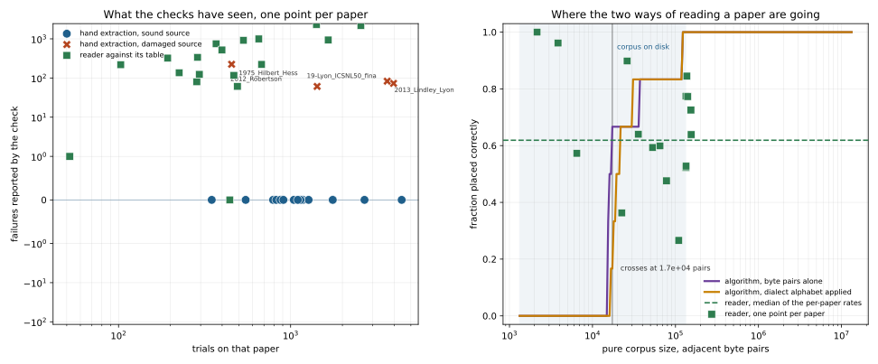

# Corpus derivation

**Purpose:** Say how wrong the pure corpus could be, from what the checks have actually seen, and say what the number rests on.
**Scope:** `tools/dev_env/Salishan/corpus_derivation.py`, which writes this file, and the three checks it reads.

Rewritten by `python tools/dev_env/Salishan/corpus_derivation.py` after every change to a hand extraction. Nothing in it is typed by hand.

## 1. What is being estimated

For one line of the pure corpus, the probability that it is not what it claims to be: not the target language, or not what the paper printed. Every number below is an upper bound on that, never a measurement of it, because every check that matters reports zero and zero failures in a sample is not a rate of zero.

With no failures in N independent trials the true rate is under 3/N with 95 percent confidence. That is the rule of three and it is what turns a clean check into a number. Where a check did see a failure, the observed rate is reported instead, because it is larger than any bound would be.

## 2. What the checks have seen

A paper contributes trials only where its extracted text is what the page prints. The others are checked against a damaged source, so their disagreements measure the source and say nothing about the table. `refs.md` names each of them.

**Why the left panel is here.** The bound in Section 3 is a single number and a single number cannot show whether it came from one clean paper or from 16. The panel puts every paper on the picture so the shape of the evidence is visible: how much each one contributed, and which ones failed anything. A reader should come away able to say which papers the number rests on.

**What to read off it.** Every paper is one point, trials against failures. The 16 on the zero line are the whole of the evidence. The 4 above it are checked against a text that is not what their page prints, so what is plotted for them is damage in the source and not a mistake in the table. The reader squares are a separate measurement in their own color, and they sit high: a reader is a script and it gets a great deal wrong. Section 5 gives those per paper, which is the only form they mean anything in.

**Why the right panel is here.** The extraction has a lifetime and the question is what carries it. A person reads a paper at a fixed accuracy however large the corpus gets, so that arm is flat. The algorithm's accuracy is a function of corpus size, so that arm climbs. Whether and where they cross decides whether the corpus is worth growing for its own sake, and the panel is what answers it.

**What to read off it.** The algorithm arm is the fraction of dialects whose distance from the other corpora pooled into one reference corpus clears twice their resolution. It starts at zero, because a small corpus resolves nothing, and it crosses the reader arm at 1.73e+04 byte pairs, which is behind the corpus already on disk. Both arms are drawn: byte pairs alone, and byte pairs with the dialect's own alphabet applied first. Comparing an algorithm given nothing against a person given a page is not a fair comparison, and the alphabet is the first part of what the extraction already knows that it can be handed.

| Paper | Rows | Forms checked | Not in paper | Tokens checked | No row holds | Counts |
|---|---|---|---|---|---|---|
| `Mellesmoen_Kye_ICSNL61` | 467 | 437 | 0 | 354 | 0 | yes |
| `1983_Hilbert` | 60 | 445 | 0 | 103 | 0 | yes |
| `Matthewson_Redan_ICSNL61` | 104 | 225 | 0 | 123 | 0 | yes |
| `AlexanderDavis_ICSNL61` | 541 | 1476 | 0 | 282 | 0 | yes |
| `22-Nater-Bella-Coola-tale-10` | 285 | 579 | 0 | 313 | 0 | yes |
| `ICSNL59_LaFontaine_Janzen_final` | 226 | 830 | 0 | 349 | 0 | yes |
| `ICSNL59_Garcia_Hannon_Stacey_final` | 371 | 784 | 0 | 488 | 0 | yes |
| `ICSNL56_DavisJ_2_final-1` | 1661 | 2131 | 0 | 557 | 0 | yes |
| `HallPhillipsICSNL60` | 406 | 1118 | 0 | 639 | 0 | yes |
| `19-Lyon_ICSNL50_final-78` | 1417 | 2788 | 41 | 1175 | 32 | no |
| `2013_Lindley_Lyon` | 653 | 2424 | 46 | 1218 | 37 | no |
| `1975_Hilbert_Hess` | 74 | 429 | 200 | 25 | 24 | no |
| `2012_Robertson` | 195 | 1324 | 40 | 102 | 21 | no |
| `WolfeICSNL60` | 772 | 763 | 0 | 378 | 0 | yes |
| `ICSNL59_Nater_2_final` | 671 | 762 | 0 | 282 | 0 | yes |
| `LyonICSNL60_Inch-2` | 537 | 666 | 0 | 435 | 0 | yes |
| `Kim_TwanaReduplication_final` | 358 | 528 | 0 | 297 | 0 | yes |
| `2013_Nater` | 2605 | 2524 | 0 | 1896 | 0 | yes |
| `Hall-et-al_-ICSNL_61-1` | 494 | 504 | 0 | 369 | 0 | yes |
| `ICSNL58_Davis_Mellesmoen_final` | 441 | 483 | 0 | 425 | 0 | yes |

16 of the 20 hand extractions are checked against a sound source. Together they put 14255 distinct written forms and 7290 language tokens through the two directions.

## 3. The channels

A wrong line arrives through one of three channels. They are separate because they fail for different reasons. The first is a person writing a form the paper does not hold, the second is a person walking past a form the paper does hold, and the third is the corpus losing a token on its way out of a reader.

The reader counts are not a channel here. A reader is written for one paper, so what it gets wrong is a fact about that paper and not a draw from a rate the next paper shares. Pooling 18 of them into one denominator would report a rate that nothing is sampling. They are in Section 5 per paper.

| Channel | Failures | Trials | Bound |
|---|---|---|---|
| a form written that the paper does not hold | 0 | 14255 | 0.00021 |
| a token in the paper that no row holds | 0 | 7290 | 0.000412 |
| a token the corpus lost on the way out | 3 | 9512 | 0.000315 |

A line has to pass all three. Taking them as independent, the joint bound is the product:

> **2.73e-11** per line

### How much of that number has settled

Three significant figures is a format, not a finding. The digit worth reporting is the one that has stopped moving, and the way to find it is to watch the bound as each paper joined the corpus.

| Papers counted | Joint bound |
|---|---|
| 1 | 1.835e-08 |
| 2 | 7.042e-09 |
| 3 | 4.421e-09 |
| 4 | 1.275e-09 |
| 5 | 7.64e-10 |
| 6 | 4.666e-10 |
| 7 | 2.954e-10 |
| 8 | 1.6e-10 |
| 9 | 1.103e-10 |
| 10 | 9.007e-11 |
| 11 | 7.684e-11 |
| 12 | 6.457e-11 |
| 13 | 5.743e-11 |
| 14 | 3.293e-11 |
| 15 | 3.002e-11 |
| 16 | 2.731e-11 |

The last 3 papers agree to 1 significant figure, so that is what the bound is quoted to above and further digits are not claimed.

### Where 1e-26 lands

The target this file was asked for is 1e-26 per line over the whole extraction. It is not reached and it is not close, and the honest form of the answer is the distance.

| Channel | Trials now | Trials at 993 papers | Bound then |
|---|---|---|---|
| a form written that the paper does not hold | 14255 | 884700 | 3.39e-06 |
| a token in the paper that no row holds | 7290 | 452435 | 6.63e-06 |
| a token the corpus lost on the way out | 9512 | 590338 | 5.08e-06 |

Reading all 993 papers of the archive, and finding nothing wrong in any of them, takes the joint bound from 2.73e-11 to about 1.14e-16. That is 10 orders of magnitude short of 1e-26.

Closing the rest by counting is not available. Each channel would have to reach about 1e+09 trials, which is roughly 2e+03 times the whole archive. There is no reading schedule that gets there, and a file claiming 1e-26 from these three channels would be reporting a number nothing measured.

What a number that small would actually need is more channels that fail independently, not more trials in these three. Section 7 is one: a term recovered from the forms and scored against a border a linguist published, which fails for a reason none of the three share. Independent channels multiply, and that is the only route to an exponent like this one. Section 4 is where the independence is doubted, and it should be read before this number is quoted anywhere.

## 4. What the number rests on

The independence is the weak part and it is weak in three named places.

* **One person read every table.** The three channels catch different kinds of mistake but they do not catch a systematic misreading of one orthography, because the same reading produced the row and the expectation. This is the largest unmodelled term and no amount of trials touches it.
* **Direction one and direction two share a source.** Both ask questions of the same extracted text. A paper whose text is wrong in a way nobody has noticed fails both at once, which is why the papers with a known-damaged source are excluded from the count instead of given a worse bound.
* **Every channel runs through one codebase.** `salish_marking.py` and `salish_unsorted.py` decide what counts as a language token, and all three channels ask them. A defect in either is common to all three at once, and two such defects have already been found this way. Both are in `refs.md`.

What would move the number honestly is a second person reading a table that has already been read. That is the one addition that fails for a reason none of the three share, and until it exists the first bullet stands above every number in this file.

## 5. Readers against their tables

| Paper | Rows asked for | Reproduced | Items written | Invented | Wrong language |
|---|---|---|---|---|---|
| `Mellesmoen_Kye_ICSNL61` | 443 | 443 | 1638 | 0 | 0 |
| `1983_Hilbert` | 52 | 50 | 323 | 1 | 0 |
| `Matthewson_Redan_ICSNL61` | 103 | 59 | 343 | 217 | 1 |
| `AlexanderDavis_ICSNL61` | 532 | 193 | 1484 | 914 | 0 |
| `22-Nater-Bella-Coola-tale-10` | 285 | 256 | 337 | 80 | 0 |
| `ICSNL59_LaFontaine_Janzen_final` | 225 | 144 | 347 | 136 | 0 |
| `ICSNL59_Garcia_Hannon_Stacey_final` | 369 | 219 | 1198 | 748 | 0 |
| `ICSNL56_DavisJ_2_final-1` | 1654 | 991 | 1625 | 574 | 362 |
| `HallPhillipsICSNL60` | 399 | 190 | 961 | 521 | 0 |
| `19-Lyon_ICSNL50_final-78` | 1413 | 376 | 7171 | 2134 | 193 |
| `2013_Lindley_Lyon` | 653 | 341 | 4551 | 996 | 0 |
| `2012_Robertson` | 193 | 101 | 435 | 323 | 0 |
| `WolfeICSNL60` | 678 | 525 | 909 | 223 | 0 |
| `ICSNL59_Nater_2_final` | 288 | 152 | 533 | 337 | 0 |
| `LyonICSNL60_Inch-2` | 491 | 415 | 603 | 61 | 0 |
| `Kim_TwanaReduplication_final` | 295 | 228 | 423 | 124 | 0 |
| `2013_Nater` | 2560 | 1857 | 4039 | 2189 | 0 |
| `Hall-et-al_-ICSNL_61-1` | 468 | 299 | 777 | 117 | 0 |

The readers get a great deal wrong. The median reproduces 0.619 of what its table asks for, and the spread runs from one paper to the next with no common rate behind it, because each reader was written against one paper's layout. That is why these are a table and not a term in Section 3.

A reader that does not reproduce a row is not by itself an impurity. The row is in the hand extraction either way, and the extraction is the oracle. What the last two columns count is what the reader added, which is the part that can reach the pure stream without a person having written it.

## 6. The word web

`tools/dev_env/Salishan/word_web/word_web.py` joins every form in the hand extractions to the forms it is related to, and writes one file per group under `build/corpora`. It has three kinds of edge, each measured off the extraction and none of them listed by hand.

* **concept**, two forms whose glosses share a content word. This is the edge that crosses an orthography, because the gloss is the one part of a form that two papers wrote the same way.
* **shape**, two forms of one group sharing a leading or trailing run of four characters. Salish morphology is heavily affixed and reduplicating. A shared run is usually a shared root or affix, and it is a measurement and not a parse.
* **context**, two forms written in the same section of the same paper by the same speaker.

The web is what makes an anchor a concept expressed as a distribution instead of a bag of characters. The byte pair distribution cannot see that two orthographies wrote one word, and the concept edge is where that is recorded.

## 7. The dialect border

Lushootseed is not one dialect. The northern and southern varieties have known land and family borders, and Mellesmoen and Kye's stress paper labels every form it cites with which one it came from. The hand extraction copied that into the `who` column, so the border sits on disk as a fact published by a linguist.

That makes it the one thing a test of this algorithm almost never has: an answer that did not come from the algorithm. `anchor_sift_algorithmic_extraction/boundary_check.py` loads the labels, sets them aside, and only compares at the end.

Comparing whole distributions does not work at this size. The method resolves at 6707 bytes and the two varieties hold 1469 and 2768, so neither the byte pair distribution nor the word web separates them, and a blind partition scores no better than the majority class. The check prints what that route would need: about 2.9 times the labeled Lushootseed now on disk.

Asking for one term at a time does work, and it is the same move the sound work uses. Both varieties are one language, so nearly all of what a distribution over their runs measures is what they have in common, and at this size that shared mass swamps the difference. Flattening the pooled counts to maximum entropy takes it out: a run is weighed against where the pooled total alone would put it. A run carrying no border information then contributes nothing however common it is. Each run is its own test, and what a run needs is enough of itself, not enough of the language.

The concept is held fixed while this is asked, over the 58 concepts both varieties name, using the word web's gloss edge. Without that control a run can separate the two sets because the varieties differ or because different words were cited, and those are not the same finding.

| Run width | Runs tested | Terms found | Expected by chance | Random borders that matched it |
|---|---|---|---|---|
| 2 | 75 | 2 | 0.20 | 1 of 200 |
| 3 | 51 | 0 | 0.14 | 200 of 200 |
| 4 | 23 | 0 | 0.06 | 200 of 200 |

| Term | Deviate | Northern | Southern |
|---|---|---|---|
| `ə́` | -3.76 | 6 | 45 |
| `əs` | 3.18 | 6 | 0 |

The last column of the first table is the test that is allowed to fail. The border is put back on the same forms at random 200 times and the radix run again on each, and at width 2 only 1 of those random borders found as much as the published one. Swapping the two sides also negates every deviate exactly, but that is what this estimator does on any two sets whatever and it is evidence of nothing.

The term carrying the border is the stressed schwa, and it is southern: 45 of them against 6 in the north over the same concepts. The paper those labels came from is Mellesmoen and Kye's comparative analysis of stress in northern and southern Lushootseed. The algorithm was shown the forms and never the labels, and what it returned is what the paper is about.

**Compiled By:** dstroy0 (Douglas Quigg) <dquigg123@gmail.com>
**Generated by:** `tools/dev_env/Salishan/corpus_derivation.py`
