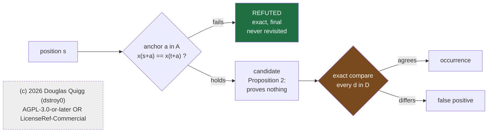

# Anchors as necessary conditions

**Purpose:** Separate what an anchor proves from what it costs, so a reader can tell which claims here
need no data and which ones are only as good as the measurements under them.
**Scope:** `test/bench/bench_ancorae_sift.c`, `test/bench/bench_ancorae_lattice.c`,
`test/bench/bench_ancorae_entropy.c`, `src/impensa_ancorae_acus/`, `test/support/mmgr_sha256.h`,
`test/support/mmgr_sha256.c`

## Abstract

An anchor is a condition copied out of a search pattern and tested at one position. This document
separates two claims about that construction that are usually stated together. The first is that no
choice of anchors can lose a true occurrence, which follows from the definition and holds for any
selection rule, any number of anchors, any alphabet, and any index set. The second is how many false
candidates survive, which is a property of a domain and is measured.

Three benches carry the measurements. Over byte strings, 9,396,207 true occurrences were examined
under three anchor selection measures including one carrying no information, at one to six anchors, on
five corpora, at needle lengths from 1 to 2048, with none refused. Over thirteen other geometries,
including a two dimensional point set, that set rotated a quarter turn, a three dimensional volume,
a domain whose symbols are complex numbers with irrational parts, and hypercubes of dimension one
through eight, a further 213,840 occurrences were examined with none refused. Cost moved by up to a factor of 6.4 between measures. What a measure
can be worth is given a closed form here, the uninformed rate over the expected minimum of $m$ size
biased draws, which equals one exactly when the distribution is uniform on its support. Entropy does
not govern that quantity: one corpus here carries more entropy than another and has less than half its
ceiling.

A refutation is shown to settle more than the position it was tested at. One read of one cell settles
every alignment whose pattern symbol differs from what was found, which is $m(1-2^{-H_2})$ of them in
expectation, confirmed to within 0.7% over 84 rows spanning three selection measures. The collision
probability that sets the candidate
rate therefore also sets the refutation distance, appearing once as a rate and once as a length.

The candidate count is shown to be an estimator of Renyi entropy of order two, equal in expectation to
the plug in estimator when the probe's own match is counted and to the standard unbiased estimator
when it is not. Scored against published estimators on sources with known parameters, it is worse in
both accuracy and running time at every setting tested, converging toward the unbiased estimator as
the probe budget approaches the corpus length. Its only advantage is the constraint it survives: it
builds no histogram and never enumerates the alphabet.

The correction that separates the two forms is the exclusion of a coincident index, and applying it
recursively gives the unbiased estimators at higher Renyi orders. Its magnitude at order two has the
closed form $(1-C)/((N-1)C\ln 2)$ bits for a plug in collision probability $C$, confirmed across nine
sources spanning four orders of magnitude. The numerator vanishes exactly at a point mass, so on a
source carrying no entropy the correction is identically zero at every order and every length.

Put against the classical algorithms on one corpus and one counter, anchoring at the rarest symbol
loses to a Horspool shift on every corpus and needle length by 1.2 to 25 times, because an anchor at
offset $a$ can advance by at most $a+1$, and advance is what governs search cost. Candidate rate does
not. Treating the two as factors of one product recovers the loss and wins 11% on C source. Replacing
the frequency model with a running advance per offset, which needs no alphabet, wins 13.2% and beats a
rule handed the corpus histogram outright.

Two negative results transfer beyond this construction. Sizing a cascade of anchors by multiplying
their individual rates underestimates the survivors by up to four orders of magnitude on structured
data, always in the direction that under-provisions. And selecting by the center of mass of a utility
loses to selecting by its maximum on every row measured, by up to 42%.

## 1. Introduction

A search for a pattern in a body of data can test every position, or it can find a cheap condition
that most positions fail and test only the survivors. The second is the older idea and the cheap
condition here is an anchor: one of the pattern's own symbols, checked at one offset.

Two questions about that arrangement get answered together in most treatments and come apart under
examination. Whether the filter is safe is a question about the construction. How much the filter
saves is a question about the data. This document keeps them apart, because the first needs no
experiment and the second cannot be settled without one.

Section 2 states the construction and proves what follows from it. Section 3 describes what was
measured and how. Section 4 reports the measurements. Section 5 discusses what the result is and what
transfers. Section 6 states the limits as numbers. Sections 7 and 8 cover the prior art that was read
and what remains open.

The digest implementation in `test/support` appears here as an instrument. It generates the uniform
control corpus and serves as the test oracle, so the strength of that control is the strength of its
vectors. Appendix A covers it.

## 2. Theory

### 2.1 Definitions

Let $\Sigma$ be a set of symbols. No structure on $\Sigma$ is assumed: no order, no metric, no finite
cardinality, and no way to enumerate its members. The only operation available is a decidable
equality between two positions.

Let $(G,+)$ be an additive group of displacements and let a domain be a map $x$ from a subset of $G$
to $\Sigma$. A pattern is a finite set $D \subset G$ of displacements together with the symbols a
chosen base position carries at them. For a base $t$ and a candidate base $s$, define

$$\mathrm{Occ}(s) \iff \forall d \in D:\; x(s+d) = x(t+d)$$

An anchor set is any subset $A \subseteq D$, and

$$\mathrm{Anc}_A(s) \iff \forall a \in A:\; x(s+a) = x(t+a)$$

Nothing in either definition requires $G$ to be the integers, $D$ to be contiguous, or $\Sigma$ to be
known.

### 2.2 Proposition 1: soundness

For every $A \subseteq D$, every domain, and every base,

$$\mathrm{Occ}(s) \;\Longrightarrow\; \mathrm{Anc}_A(s)$$

The proof is that $A$ is a subset of $D$, so a conjunction over $D$ contains the conjunction over $A$.
The search runs the contrapositive:

$$\neg\,\mathrm{Anc}_A(s) \;\Longrightarrow\; \neg\,\mathrm{Occ}(s)$$

A position an anchor rejects is settled exactly and permanently, with no verification, and no later
stage revisits it.

### 2.3 Proposition 2: no completeness

For every proper subset $A \subsetneq D$, the converse

$$\mathrm{Anc}_A(s) \;\Longrightarrow\; \mathrm{Occ}(s)$$

is not entailed, in any domain and in any state. A witness is any $s$ agreeing with the base on $A$
and differing on some $d \in D \setminus A$, and the definitions permit such an $s$ whenever
$|\Sigma| > 1$. The only $A$ for which the converse holds is $A = D$, where the filter has become the
verification.

So a matching anchor establishes nothing. The exact compare cannot be removed by any amount of
knowledge about the domain, and adding anchors reduces the survivors without ever reaching certainty.

### 2.4 Three corollaries

**The selection rule is free.** Proposition 1 quantifies over every subset and never mentions what
chose one. No cost table, no random table, and no absence of a table can produce a false negative.
What a measure moves is how often the rejection fires, which is cost.

**The alphabet need not be known.** Both predicates are equalities between positions. Where $\Sigma$
cannot be enumerated no frequency table exists, and the flat measure is what remains. Maximum entropy
is therefore the base case for this construction, and a weighted table is the special case a known
domain affords.

**The index set need not be ordered.** The definitions use $+$ and never $<$. A grid, a volume, and a
rotated point configuration differ only in which elements of $G$ appear in $D$. A rotation is a
permutation of $D$, so it changes no term in either predicate.

### 2.5 The cost model

Model occurrences of an anchor symbol as a Bernoulli process at rate $q$. Over $N$ candidate
positions,

$$\mathbb{E}[C_1] = N q, \qquad \mathbb{E}[S] = \frac{1}{q}$$

$\mathbb{E}[C_1]$ is what the verify step pays for and $\mathbb{E}[S]$ is the run a skipping search
never touches. Reducing $N$ candidates to $O(1)$ survivors requires $\log_2 N$ bits of discrimination
and one anchor supplies $-\log_2 q$ bits.

The second expression is Kac's lemma. For a stationary ergodic source the expected return time to a
set of measure $q$ is exactly $1/q$, so the skip is a recurrence time and not an artifact of the
filter. That names an assumption the construction does not supply. Proposition 1 guarantees that no
occurrence is lost, and Section 2.5 prices the search, and neither says a pattern occurs at all. That
last guarantee belongs to the source: a stationary ergodic process visits any event of positive
probability almost surely, and a process that is not stationary or not ergodic carries no such
promise. Three guarantees with three owners, and only the first is this document's.

For an uninformed anchor, the symbol is drawn from the domain by the domain's own frequencies, so

$$q \;=\; \sum_{\sigma \in \Sigma} p(\sigma)^2 \;=\; 2^{-H_2}, \qquad
H_2 \;=\; -\log_2 \sum_{\sigma} p(\sigma)^2$$

with $H_2$ the Renyi entropy of order two. This predicts the uninformed candidate count from the
domain alone, before any pattern is chosen, and Section 4.4 tests it.

### 2.6 The construction as a diagram



**Figure 1.** The anchor filter, as `bench_ancorae_lattice.c:193-239` implements it. The green box is
the only place the method is certain. Everything to the right of the candidate is cost.

## 3. Methods

### 3.1 What each bench measures

| bench | question | reports |
|---|---|---|
| `bench_ancorae_sift.c` | cost and independence over byte strings | candidates, skip, $I(d)$, $z$, refusals |
| `bench_ancorae_lattice.c` | whether Proposition 1 survives off the line | candidates, refusals |
| `bench_ancorae_entropy.c` | what the candidate count estimator is worth | bias, root mean square error |
| `bench_ancorae_ab.c` | how a whole search compares to one built another way | corpus symbol accesses |

All four report counts. Nothing is timed, no row is a performance claim, and every number is a
property of the data and the geometry, identical on every part.

### 3.2 Separating the two claims in the reporting

Every row carries a correctness column and a cost column, graded differently. The correctness column
counts true occurrences that an anchor rejected, and Proposition 1 says it has one acceptable value.
A nonzero entry there would be a defect in the bench, never a property of a domain. The cost column is
expected to move with the measure, the anchor count and the geometry.

A verdict of `none` is printed where a case had nothing to check, so an empty sweep cannot be read as
a passing one (`test/bench/bench_ancorae_sift.c:715-757`).

### 3.3 Byte corpora

Four corpora, 2048 bytes each except where stated, chosen to span the range of factor complexity:

| corpus | content | $H_2$ (bits) |
|---|---|---|
| `flat` | one byte repeated | 0.000 |
| `structured` | 1408 bytes of C source | 3.620 |
| `english` | non-repeating English prose | 3.692 |
| `periodic16` | 16 byte fixed width records, layout repeating and content not | 4.611 |
| `uniform` | SHA-256 in counter mode | 7.832 |

Needles are drawn from the corpus so every one genuinely occurs. A corpus built by repeating a unit is
self similar at that scale and every needle then occurs once per repetition by construction, which
ruined an earlier measurement recorded in Section 6.5. The fill truncates instead of repeating
(`test/bench/bench_ancorae_sift.c:190-193`).

### 3.4 Anchor selection measures

Three, differing as much as the interface allows (`test/bench/bench_ancorae_sift.c:342-347`,
`361-420`):

| policy | how a symbol is priced |
|---|---|
| `table` | the linked cost table, ranking a byte by rarity |
| `random` | a permutation of 0 through 255 drawn from SHA-256, unrelated to frequency |
| `maxent` | one cost for every byte, so the table carries no information |

`random` is a permutation, so every cost stays distinct and the picker behaves exactly as under the
real table. The only thing removed is the table being right. `maxent` makes the picker take the
leftmost offsets, so anchors land adjacent, which is the hardest arrangement for two rates to
multiply.

### 3.5 Geometries

Six cases share one core that receives a list of valid base positions, a list of displacements, and a
callback answering whether two positions carry the same symbol
(`test/bench/bench_ancorae_lattice.c:80`, `193-239`). The core has no dimension parameter, because the
geometry is entirely inside the base list, and no symbol type, because it only asks whether two agree.

| case | $G$ | $D$ |
|---|---|---|
| `line1d` | $\mathbb{Z}$ | 8 contiguous offsets |
| `grid2d_box` | $\mathbb{Z}^2$ | a 2 by 4 rectangle |
| `grid2d_scatter` | $\mathbb{Z}^2$ | 8 points in a 5 by 5 window, no row or column filled |
| `grid2d_turned` | $\mathbb{Z}^2$ | that scatter under $(r,c) \mapsto (c, 4-r)$ |
| `cube3d_box` | $\mathbb{Z}^3$ | a 2 by 2 by 2 block |
| `field1d_complex` | $\mathbb{Z}$ | 8 contiguous offsets over complex symbols |
| `cube1d` to `cube8d` | $\mathbb{Z}^d$, $d = 1 \dots 8$ | a star: the origin, then one step out along each axis in turn |

`field1d_complex` holds `double _Complex` values built from square roots of primes, compared over
their storage (`test/bench/bench_ancorae_lattice.c:479-511`). No value is read, ordered, or
interpreted anywhere in the file.

Anchor subsets are chosen by three uninformed rules: the leading points, an even stride across them,
and a permutation drawn from SHA-256 (`test/bench/bench_ancorae_lattice.c:291`). No cost table exists
in that file and none can, since a domain with an unenumerable alphabet has no frequencies to weigh.

### 3.6 Estimator comparison

Sources are written down as distributions before any data exists, so the true collision probability is
known in advance and no estimator is scored against a histogram of the corpus it was computed from
(`test/bench/bench_ancorae_entropy.c:160`). Eight sources: uniform over 2, 16 and 256 symbols; Zipf at
exponents 0.5, 1.0 and 1.5; and two point sources at 0.90 and 0.99. Corpora are drawn by inverse
transform sampling at lengths 256, 1024, 4096 and 16384, with 64 independent trials per row.

Four estimators of the same quantity are scored by bias and root mean square error in bits:

| estimator | expression | needs |
|---|---|---|
| plug in | $\sum_\sigma \hat p(\sigma)^2$ | a histogram |
| unbiased | $\sum_\sigma n_\sigma(n_\sigma-1) / N(N-1)$ | a histogram |
| probe, self counted | mean over probes of matching positions over $N$ | neither |
| probe, self excluded | the same, less the probe's own match | neither |

The unbiased estimator and the first order bias correction of the plug in estimator are the same
expression, so they are one estimator and not two
(`test/bench/bench_ancorae_entropy.c:256-344`).

A fifth quantity, the most common value estimate of min entropy from NIST SP 800-90B section 6.3.1, is
computed for context and is not scored on the same scale, because min entropy is a different property
(`test/bench/bench_ancorae_entropy.c:379`).

## 4. Results

### 4.0 One number, and the three places it stops

The sections below read as a list of separate findings and are not one. They are a single quantity, the
collision probability $2^{-H_2}$, determining every cost in the construction, together with the three
conditions under which it stops determining anything. This section says which is which so the rest can
be read as one argument.

**Nothing about correctness is in this at all.** Sections 4.1 and 4.2 report zero refusals over
9,396,207 and 213,840 true occurrences, across three selection measures, thirteen geometries,
dimensions one through eight, a rotated point set, and a complex alphabet. Proposition 1 mentions no
distribution, so no distributional parameter can reach it. Everything else on this page is cost.

**The cost is one number.** Each of these is a function of $2^{-H_2}$ and the two sizes $m$ and $N$:

| quantity | form | where |
|---|---|---|
| candidate rate per position | $2^{-H_2}$ | 4.4 |
| alignments settled by one read | $m(1-2^{-H_2})$ | 4.4.1 |
| estimator bias correction | $(1-C)/((N-1)C\ln 2)$ | 4.5.1 |
| fraction an in-order walk collects | $1/((1+m2^{-H_2})(1-2^{-H_2}))$ | 4.9.4 |
| where the advance saturates | $3 \cdot 2^{H_2}$ | 4.9.2 |
| anchors before the space is spent | $\log_2 N / H_2$ | 4.6.1 |
| free order probe stride | $m H_2 / \log_2(m H_2 \ln 2)$ | 4.9.5 |
| candidates in $d$ dimensions | $1 + (P-1)2^{-nH_2}$ | 4.2 |

The last row is the one that makes the others worth stating together. It holds unchanged from a line to
an eight dimensional hypercube, over an alphabet of complex numbers with irrational parts, which is
where the parameter shows it does not depend on the geometry or on what a symbol is.

**It stops in three places, and every failure recorded in this document is one of them.**

*The number is not unique, it is indexed by a carving.* There is no $H_2$ of a corpus, only $H_2(w)$ of
a corpus read $w$ bits at a time, and Section 4.10 measures it falling from 0.984 to 0.600 bits per bit
between $w = 1$ and $w = 16$ on English. Every figure above uses $w = 8$, which nothing here justifies.

*A second moment is not a distribution.* Section 4.3.1 needs the expected minimum of $m$ size biased
draws, which is a property of the whole order statistics. Entropy orders the corpora wrongly there, and
Section 4.8 prices a mismatched reference at 25 to 30 times, which no collision probability predicts.

*Independence is assumed throughout and fails.* Section 4.6 measures the product rule wrong by four
orders of magnitude, Section 4.7 finds correlation surviving to separation seven, Section 4.6.1 has
2.98 anchors predicted against 6 measured at $m = 16$, and Section 4.9.3 has the distance field losing
on periodic data alone. The parameter predicts none of these, because each is a statement about the
joint distribution and it is a statement about a marginal.

### 4.1 The invariant over byte strings

Sweeping three policies, one to six anchors, five corpora, and needle lengths 1, 2, 3, 4, 16, 64, 256,
1024 and 2048:

**582 rows hold. 9,396,207 true occurrences examined. 0 refused.**

A further 210 rows report `none`, and each is a case where the needle carries fewer distinct offsets
than the anchor count. That cause was checked and no row reports `none` for any other reason.

The degenerate lengths are in the sweep deliberately. A needle of one byte is the shortest thing that
can carry an anchor, a needle as long as the corpus leaves one position, and the flat corpus makes
every position an occurrence, so it offers the largest number of true results available to lose.

### 4.2 The invariant off the line

Sweeping three uninformed selection rules and one to six anchors over the six geometries above and a
further eight hypercubes of dimension one through eight:

**252 rows hold. 213,840 true occurrences examined. 0 refused.**

Candidates admitted, rule `shuffled`, against the $N \cdot 2^{-n}$ the two symbol alphabet predicts:

| domain | $n{=}1$ | $n{=}2$ | $n{=}3$ | $n{=}4$ | $n{=}5$ | $n{=}6$ |
|---|---|---|---|---|---|---|
| predicted | 2044.5 | 1022.3 | 511.1 | 255.6 | 127.8 | 63.9 |
| `line1d` | 2044.7 | 1025.7 | 516.7 | 259.4 | 129.2 | 65.4 |
| `grid2d_scatter` | 1797.8 | 901.5 | 449.5 | 223.1 | 112.6 | 56.9 |
| `grid2d_turned` | 1801.7 | 902.7 | 448.6 | 223.3 | 112.1 | 56.7 |
| `cube3d_box` | 1685.3 | 840.5 | 422.3 | 212.7 | 105.2 | 52.3 |
| `field1d_complex` | 2046.4 | 1023.4 | 511.9 | 256.2 | 128.9 | 64.7 |

The grid and cube rows sit below the prediction because those geometries admit fewer base positions,
3600 and 3375 against 4089 on the line. Within each row the halving per anchor is what the model
gives.

**A rotation is invisible.** `grid2d_scatter` and `grid2d_turned` are the same eight points a quarter
turn apart and agree at every anchor count, which puts Section 2.4's third corollary on a
measurement.

**The complex alphabet behaves as bytes do.** `field1d_complex` matches `line1d` to within 0.1% at
every count, with the geometry held fixed and only the symbol type changed.

**The cost law holds at every dimension swept.** The hypercube cases place one pattern point at the
origin and each of the rest one step out along the next axis, so the pattern touches a new axis for
every point it has and is never a lower dimensional figure sitting in a larger space
(`test/bench/bench_ancorae_lattice.c:686`). Against $1 + (P-1)2^{-n}$ for $P$ positions and $n$
anchors, which includes the one match the pattern is guaranteed against itself:

| dimension | 1 | 2 | 3 | 4 | 5 | 6 | 7 | 8 |
|---|---|---|---|---|---|---|---|---|
| positions | 4089 | 3600 | 4913 | 4096 | 1024 | 729 | 2187 | 256 |
| ratio at $n{=}1$ | 1.001 | 1.000 | 1.000 | 1.001 | 1.001 | 1.007 | 0.999 | 0.995 |
| ratio at $n{=}3$ | 0.991 | 0.995 | 1.002 | 1.000 | 0.994 | 1.028 | 0.999 | 0.970 |
| ratio at $n{=}6$ | 0.969 | 1.020 | 1.017 | 1.001 | 0.980 | 0.996 | 1.013 | 0.979 |

Across all 48 rows the ratio stays between 0.969 and 1.028. Seven points off the origin can touch at
most seven axes, so the dimension eight pattern spans seven of its eight, which is a limit of the
pattern size and not of the construction.

An earlier version of this table omitted the guaranteed self match from the prediction and drifted to
a ratio of 1.22 at the smallest domain. That is the same error recorded twice already in Section 6.5,
made a third time.

### 4.3 What the measure is worth

Candidates admitted by one anchor at needle 16, english cost table, fingerprint `69c2e2df`:

| corpus | $H_2$ | `table` | `random` | `maxent` | table over maxent |
|---|---|---|---|---|---|
| `flat` | 0.00 | 2032 | 2032 | 2032 | 1.00 |
| `structured` | 3.62 | 17.6 | 47.9 | 113.3 | 6.43 |
| `english` | 3.69 | 26.9 | 108.6 | 149.5 | 5.56 |
| `periodic16` | 4.61 | 44.4 | 96.8 | 82.3 | 1.85 |
| `uniform` | 7.83 | 7.53 | 7.84 | 7.61 | 1.01 |

On `flat` no anchor can ever fail, so all eighteen combinations of policy and anchor count report 2032
candidates out of 2033 positions. On `uniform` the three policies agree to within 4%. Between them the
informed table is worth 6.4 times.

The column ordering rules out entropy as the governing quantity. `periodic16` carries more entropy than
`english` and its ratio is less than half as large, and `structured` has the lowest entropy of the four
non-degenerate corpora and the second largest ratio. Section 4.3.1 derives the quantity that does
govern it.

#### 4.3.1 What a measure can be worth, and its ceiling

An informed anchor is the rarest symbol among the $m$ that a pattern carries, and a pattern drawn from
the corpus presents each symbol with probability equal to its own frequency. So the informed rate is
the expectation of the minimum of $m$ size biased draws. Writing

$$F(t) \;=\; \sum_{\sigma:\, p_\sigma \le t} p_\sigma$$

for the size biased distribution function, the survival form of the expectation gives

$$\mathbb{E}[\min\nolimits_m] \;=\; \int_0^1 \bigl(1 - F(t)\bigr)^m \, dt, \qquad
\text{ceiling}(m) \;=\; \frac{\sum_\sigma p_\sigma^2}{\mathbb{E}[\min_m]}$$

The numerator is the uninformed rate from Section 2.5, so the quotient is what a table matched to the
corpus would buy over no table at all. It is an upper bound on every measure, since no rule can pick a
symbol rarer than the rarest one present.

**The ceiling is exactly 1 if and only if $p$ is uniform on its support.** If every nonzero $p_\sigma$
equals $1/k$ then $F$ is a single step, the integral collapses to $1/k$, and $\sum_\sigma p_\sigma^2$
is also $1/k$. If two nonzero probabilities differ then the rarest of $m$ draws is strictly below the
size biased mean for $m \ge 2$ and the quotient exceeds one. A point mass and a uniform distribution
are both uniform on their support, which is why both ends of Section 4.3 report a ratio of one, and
entropy plays no part in either case.

Computed at needle 16 from each corpus's own frequencies (`test/bench/bench_ancorae_sift.c:933`):

| corpus | $H_2$ | uninformed rate | informed rate | ceiling | measured | captured |
|---|---|---|---|---|---|---|
| `flat` | 0.000 | 1.000000 | 1.000000 | 1.000 | 1.00 | exact |
| `structured` | 3.620 | 0.081313 | 0.004483 | 18.14 | 6.43 | 35% |
| `english` | 3.692 | 0.077371 | 0.011887 | 6.51 | 5.56 | 85% |
| `periodic16` | 4.611 | 0.040927 | 0.013708 | 2.99 | 1.85 | 62% |
| `uniform` | 7.832 | 0.004389 | 0.002172 | 2.02 | 1.01 | 50% |

The ceiling orders the corpora where entropy does not, and it is exact at the point mass.

Two readings of the gap between ceiling and measured are separable. On `english` the linked table is
the English table, and 85% is the highest fraction captured anywhere in the study, which is the matched
table effect appearing as a number. On `structured` the same table reaches 35% of a much larger
ceiling, which is a mismatch cost.

The `uniform` row needs its own reading. Its ceiling of 2.02 is not a property of the source, which is
uniform and therefore has a ceiling of exactly 1 by the statement above. It is a property of the
sample: 2033 draws over 256 symbols do not land uniformly, and the resulting fluctuation leaves
something for an oracle to exploit. No fixed table can capture it, because the fluctuation is not a
feature of the source and a table cannot know which symbols this particular corpus happened to
under-represent. The measured 1.01 is that impossibility, quantified.

### 4.4 The collision entropy prediction

Predicted `maxent` candidate count against measured, with one subtracted from each prediction because
the cost rows exclude the needle's own occurrence:

| corpus | $H_2$ | predicted | measured | error |
|---|---|---|---|---|
| `flat` | 0.000 | 2033 | 2032 | 0.05% |
| `structured` | 3.620 | 112.3 | 113.3 | 0.9% |
| `english` | 3.692 | 156.3 | 149.5 | 4.3% |
| `periodic16` | 4.611 | 82.2 | 82.3 | 0.1% |
| `uniform` | 7.832 | 7.92 | 7.61 | 4.0% |

The residual is sampling bias in the needle draw. Needles are taken at a fixed stride, so on English
the anchor byte is a biased letter draw, and the two rows with the largest error are the two whose
stride interacts with their structure.

#### 4.4.1 A refutation is not local

Sections 2.2 and 4.1 treat a refutation as settling one position, and it settles many.

Testing the anchor at pattern offset $a$ reads the cell at $s+a$ and finds some symbol $c$. For any
shift $\delta$, the alignment beginning at $s+\delta$ places pattern offset $a-\delta$ on that same
cell. That alignment can hold only if $\nu_{a-\delta} = c$. So one read settles every shift whose
pattern symbol differs from what was found, and the number of them is

$$R \;=\; m \;-\; \bigl|\{\, i : \nu_i = c \,\}\bigr|$$

A symbol the pattern does not carry refutes every alignment touching the cell. Taking the expectation
over a corpus, with the pattern drawn from that corpus so $c$ arrives with its own frequency,

$$\mathbb{E}[R] \;=\; m\Bigl(1 - \sum_\sigma p_\sigma^2\Bigr) \;=\; m\bigl(1 - 2^{-H_2}\bigr)$$

The quantity that sets the candidate rate in Section 4.4 sets the refutation distance here, appearing
once as a rate and once as a length. Measured at every needle length over every corpus
(`test/bench/bench_ancorae_sift.c:1024`):

| corpus | $m{=}4$ | $m{=}16$ | $m{=}64$ | $m{=}256$ | refuted over $m$ |
|---|---|---|---|---|---|
| `english` | 0.9962 | 0.9997 | 1.0000 | 1.0002 | 0.923 |
| `structured` | 0.9939 | 0.9991 | 0.9985 | 0.9934 | 0.917 |
| `periodic16` | 0.9999 | 0.9999 | 1.0001 | 1.0001 | 0.959 |
| `uniform` | 1.0001 | 1.0000 | 1.0000 | 1.0000 | 0.996 |
| `flat` | exact | exact | exact | exact | 0.000 |

Entries are measured over predicted. This policy produces 35 rows, of which 28 carry a ratio and it
stays between 0.9934 and 1.0011. Over all three policies, 84 rows carry a ratio and the range is
0.9932 to 1.0011. On `flat` both sides are exactly zero at every length, since every cell holds the one
byte the pattern is made of and no read can settle anything.

The last column is constant in $m$ within each corpus, which the expectation requires: the fraction of
alignments a read settles is $1 - 2^{-H_2}$ and belongs to the corpus alone. One read settles 92% of
the alignments touching it on English prose and 99.6% on a uniform corpus.

This is the bad character shift of classical string search, reached from Proposition 1 instead of from
a shift table, and priced by the collision probability. Nothing in the derivation uses an order on
positions, so it carries to the geometries of Section 4.2, though it was measured only on byte
strings.

### 4.5 The candidate count as an estimator

Bias and root mean square error in bits, 64 trials, probe budget 64:

| source | $N$ | true $H_2$ | plug in | unbiased | probe, self | probe, no self |
|---|---|---|---|---|---|---|
| `uniform256` | 256 | 8.000 | -0.984 / 0.986 | +0.029 / 0.126 | -0.964 / 0.969 | +0.074 / 0.210 |
| `uniform256` | 1024 | 8.000 | -0.325 / 0.325 | -0.005 / 0.029 | -0.324 / 0.335 | -0.003 / 0.108 |
| `uniform256` | 4096 | 8.000 | -0.088 / 0.089 | -0.001 / 0.007 | -0.077 / 0.085 | +0.010 / 0.040 |
| `zipf1.0` | 4096 | 4.515 | -0.008 / 0.061 | -0.001 / 0.061 | -0.050 / 0.204 | -0.042 / 0.203 |
| `skew0.99` | 4096 | 0.029 | -0.000 / 0.005 | -0.000 / 0.005 | +0.000 / 0.019 | +0.000 / 0.020 |

**The probe counting its own match reproduces the plug in estimator, and excluding it reproduces the
unbiased estimator.** At `uniform256` and $N=256$ the plug in bias is $-0.984$ bits and the probe with
self is $-0.964$; the unbiased bias is $+0.029$ and the probe without self is $+0.074$. The
subtraction that Section 6.5 records as a measurement error is the standard bias correction, reached
from the other direction.

**The probe is worse than both published estimators at every setting tested.** Its error is set by the
probe budget and not by the corpus length. Root mean square error at $N = 16384$, `zipf1.0`:

| probe budget | 16 | 64 | 256 | 1024 | 4096 |
|---|---|---|---|---|---|
| probe, no self | 0.602 | 0.252 | 0.122 | 0.062 | 0.039 |
| unbiased | 0.028 | 0.028 | 0.028 | 0.028 | 0.028 |
| ratio | 21.7 | 9.1 | 4.4 | 2.2 | 1.4 |

The probe's error falls as one over the square root of the budget and converges toward the unbiased
estimator without reaching it. The probe is also more expensive, at $O(kN)$ against $O(N)$ for a
histogram. Its one advantage is the constraint it survives: it builds no histogram and never
enumerates the alphabet, so it applies where the other two cannot be computed at all. In a search it
is free, because the candidate count is a byproduct of work already being done.

#### 4.5.1 The correction applied recursively

The correction excludes a position from being paired with itself. Applied $k$ deep it excludes every
tuple in which any two indices coincide, which is a falling factorial in the numerator and the
denominator, and that is the unbiased estimator of $\sum_\sigma p(\sigma)^k$
(`test/bench/bench_ancorae_entropy.c:463-500`). So the correction can be climbed, and each rung
estimates Renyi entropy at the next order.

At order two the correction has a closed form. Writing $C = \sum_\sigma \hat p(\sigma)^2$ for the plug
in collision probability, the corrected form is $(CN-1)/(N-1)$, so the two differ by

$$\Delta C \;=\; \frac{1 - C}{N-1}, \qquad
\Delta H_2 \;\approx\; \frac{1-C}{(N-1)\,C\,\ln 2}\ \text{bits}$$

That numerator answers the question the ladder was built for. A point mass has $C = 1$ exactly, so
$1 - C$ is exactly zero and the correction is exactly zero, for every length. The same holds at every
order: with one symbol $n_\sigma = N$, the plug in form gives $\sum \hat p^m = 1$ and the corrected
form gives $N^{(m)}/N^{(m)} = 1$, so both are one and their difference is not merely small. Measured at
orders 2 through 5 and lengths 256, 1024, 4096 and 16384, every entry is 0.0000 bits.

Correction magnitude in bits at order 2, $N = 4096$, 64 trials, against the closed form:

| source | $H_2$ | predicted | measured |
|---|---|---|---|
| `point1` | 0.000 | 0.0000 | 0.0000 |
| `skew0.99` | 0.029 | 0.0000 | 0.0000 |
| `skew0.90` | 0.286 | 0.0001 | 0.0001 |
| `uniform2` | 1.000 | 0.0004 | 0.0004 |
| `zipf1.5` | 2.364 | 0.0015 | 0.0015 |
| `uniform16` | 4.000 | 0.0053 | 0.0053 |
| `zipf1.0` | 4.515 | 0.0077 | 0.0077 |
| `zipf0.5` | 7.254 | 0.0534 | 0.0525 |
| `uniform256` | 8.000 | 0.0898 | 0.0871 |

The form holds across four orders of magnitude in the correction, with the largest disagreement at
`uniform256` where the first order approximation of the logarithm is weakest.

The quantity governing the size is how many times a symbol was seen, since a falling factorial differs
from a plain power in proportion to that count. A head symbol appearing 4055 times out of 4096 loses
almost nothing by refusing to pair with itself. A symbol appearing 16 times loses a measurable
fraction.

Climbing the ladder does not settle on one behavior, and which way a source moves depends on where its
mass sits. On a spread source the correction grows with every rung, because thin counts stay thin at
higher order: `uniform256` gives 0.0871, 0.1256, 0.1616 and 0.1955 at orders 2 through 5. On a skewed
source it shrinks, because higher moments concentrate on the head symbol where the count is large:
`zipf0.5` gives 0.0525, 0.0393, 0.0327 and 0.0331. On the point mass it is zero at every rung.

This correction and the ceiling in Section 4.3.1 answer to different properties of a distribution and
neither one predicts the other. The ceiling is one when the probabilities are equal on the support, at
any entropy and any corpus length. The correction is zero only at a point mass, and its size is set by
how many times each symbol was seen, so it falls with corpus length while the ceiling does not. A
uniform source and a point mass share a ceiling of one and have corrections of 0.0871 and 0.0000 bits
at $N = 4096$. The two were measured on different source sets and no joint sweep was run.

### 4.6 Stacking anchors, and the product rule

Ratio of observed candidates to the independence prediction, needle 16
(`test/bench/bench_ancorae_sift.c:541-632`):

| corpus | policy | $n{=}2$ | $n{=}3$ | $n{=}4$ | $n{=}5$ | $n{=}6$ |
|---|---|---|---|---|---|---|
| `uniform` | `table` | 1.23 | - | - | - | - |
| `english` | `table` | 1.44 | 3.80 | 7.68 | 160.7 | - |
| `structured` | `table` | 8.46 | 163.2 | 663.4 | 2226.5 | 8186.1 |
| `english` | `maxent` | 2.20 | 12.1 | 77.4 | 438.4 | 2409.4 |
| `structured` | `maxent` | 2.34 | 8.53 | 28.9 | 118.0 | 389.7 |

A dash marks a cell where the survivors reached zero, so the ratio has no content.

The product rule overpromises and the error compounds with every anchor added. On `structured` under
the informed table it is wrong by three orders of magnitude at four anchors and by four at six. The
direction is the dangerous one: more candidates survive than the arithmetic predicts. On `uniform` the
ratio holds at 1.23 and the survivors reach zero by three anchors, which is the regime where the
arithmetic is exact.

#### 4.6.1 Where a stack runs out of space, derived

Section 2.5 budgets a search in bits: reducing $N$ candidates to $O(1)$ survivors needs $\log_2 N$ bits
and one anchor supplies $-\log_2 q$ of them. For an uninformed anchor that is $H_2$ bits, so a stack of
$n$ exhausts the space at

$$n \;=\; \frac{\log_2 N}{H_2}$$

Against the first anchor count whose measured excess candidate count reaches zero:

| corpus | $H_2$ | $N$ | predicted | measured, $m = 64$ and 256 | measured, $m = 16$ |
|---|---|---|---|---|---|
| `uniform` | 7.832 | 2048 | 1.40 | 3 | 3 |
| `periodic16` | 4.611 | 2048 | 2.39 | 3 to 4 | 4 |
| `structured` | 3.620 | 1408 | 2.89 | beyond 6 | beyond 6 |
| `english` | 3.692 | 2048 | 2.98 | 3 | 6 |
| `flat` | 0.000 | 2048 | unbounded | never | never |

The prediction assumes each anchor contributes its full $H_2$ bits, which requires them to be
independent. Section 4.7 puts that at separation 7 and above. At $m = 64$ and beyond there is room for
that and the bound is exact on English, predicting 2.98 against a measured 3. At $m = 16$ there is not,
the anchors sit close enough to be correlated, each supplies less than $H_2$ bits, and English needs 6.

**The gap between predicted and measured exhaustion is the independence failure of Section 4.6, read a
second way.** `structured` has the largest cascade ratio and the largest gap. `flat` carries no bits at
all, so no stack of any size removes anything, and the row that never exhausts is the same corpus every
other instrument reports zero on.

So a stack terminates at three or four here, and it terminates because the space is spent and not
because the arithmetic fails.

### 4.7 Separation, periodicity, and a layout prediction

Independence $I(d)$ against anchor separation, needle 64, policy `table`:

| stride | 1 | 2 | 3 | 5 | 7 | 8 | 13 | 17 |
|---|---|---|---|---|---|---|---|---|
| `english` | 6.05 | 2.59 | 1.50 | 1.21 | 0.99 | 1.02 | 1.07 | 1.21 |
| `structured` | 6.20 | 3.70 | 3.79 | 2.88 | 1.46 | 1.54 | 1.07 | 1.17 |

Correlation is a function of distance and not of needle length, dying by stride 7 in both corpora. The
`uniform` control is reported as $z$ and not as $I$: its joint excess runs from 0.00 to 0.09 against a
prediction of 0.03, so the ratio swings between 0.00 and 3.03 on counts too small to carry one. Every
$|z|$ in that row is at most 1.7, consistent with independence at every stride measured.

On `periodic16`, reported as $z$:

| stride | 3 | 7 | 11 | 16 | 17 |
|---|---|---|---|---|---|
| needle 32 | 0.9 | **4.0** | -0.7 | **5.3** | 0.7 |
| needle 64 | -0.3 | **6.6** | -0.1 | **12.3** | 0.4 |
| needle 128 | -0.1 | **6.5** | 0.7 | **13.1** | 0.5 |
| needle 256 | -0.4 | **5.5** | 0.7 | **12.6** | 1.4 |

A stride equal to the record period is the strongest correlation measured anywhere here, $I = 5.82$ at
$z = 12.3$, reproducing at every needle length. A coprime stride of 17 is clean.

$I(d)$ is an exponentiated pointwise mutual information, so $\mathrm{PMI}(d) = \log_2 I(d)$ and
the second anchor's contribution is $-\log_2 p_\beta - \mathrm{PMI}(d)$. At $I = 5.82$ the loss
is 2.54 bits, so an anchor nominally worth 8 delivers 5.5.

For fixed width records of period $T$ with field offsets $F$, a layout bound predicts

$$D_x \;\subseteq\; \{T\}\ \cup\ \{\,|f_i-f_j| \;:\; f_i,f_j\in F\,\}$$

Here $T = 16$ and the punctuation sits at $F = \{4,11,15\}$, so $\hat{D} = \{4,7,11,16\}$. Correlated
is $|z| > 2$, and lags 1 and 2 are excluded because short range correlation is present in every corpus
here, English included at $I(1) = 6.05$.

| $d$ | in $\hat{D}$ | $I(d)$ | $z$ | measured | verdict |
|---|---|---|---|---|---|
| 3 | no | 0.95 | -0.3 | independent | agrees |
| 4 | **yes** | 0.96 | -0.3 | independent | **necessity fails** |
| 5 | no | 1.31 | 2.1 | correlated | **sufficiency fails** |
| 7 | **yes** | 2.46 | 6.6 | correlated | agrees |
| 8 | no | 1.64 | 4.1 | correlated | **sufficiency fails** |
| 11 | **yes** | 0.99 | -0.1 | independent | **necessity fails** |
| 13 | no | 1.13 | 0.9 | independent | agrees |
| 16 | **yes** | 5.82 | 12.3 | correlated | agrees |
| 17 | no | 1.08 | 0.4 | independent | agrees |

Five of nine agree, and the four failures are the result. The $d = 5$ row sits at $z = 2.1$ against a
threshold of 2.0, so that one is a borderline call.

Necessity fails at $d \in \{4,11\}$ because a predicted distance only bites when the picker selects
both of its endpoints, and selection is driven by the cost table. Sufficiency fails at $d = 8$ because
$8 = T/2$ and a periodic sequence carries autocorrelation at divisors of its period, which the bound
as written omits. Adding harmonics would capture that and would widen $\hat{D}$, worsening the
necessity side. So $\hat{D}$ bounds the risky set in neither direction, and the rule that survives is
the weak one: a stride is safe when it has been measured to be.

One confound is stated here so no reader has to find it. The anchor is picked by the English cost
table applied to non-English data, so these rows measure the profile mismatch as well as the
periodicity.

### 4.8 The reference measure

$I(d)$ and the skip are both divergences from a reference, and the cost table is that reference. A
build links exactly one of five. Skip distance at needle 64, stride 0:

| corpus | english | generic | uri | route |
|---|---|---|---|---|
| english prose | 159.1 | **168.0** | 5.8 | 6.0 |
| C source | 147.7 | **206.7** | 5.9 | 6.8 |
| periodic records | 73.2 | 73.2 | 16.6 | 9.5 |
| uniform (control) | 277.1 | 256.0 | 277.7 | 277.1 |

This table was measured against an earlier control generator and its uniform row is on that generator.
The claim it carries is that the four profiles agree there, and that claim does not depend on which
uniform source was used.

The wrong reference costs 25 to 30 times. `uri` and `route` take the skip on real text from about 160
to about 6, which is the largest effect measured anywhere in this document.

The prediction that a corpus matched table wins is refuted. `generic` beats `english` on English prose
and beats it decisively on C source. So the case for instantiating the table is not that it should
match the data, which is unsupported. It is that the wrong table costs 25 times and a build holds one.

On the uniform corpus every reference performs the same, at 277.1, 256.0, 277.7 and 277.1. At maximum
entropy the choice of $Q$ stops mattering, because there is no gradient for a reference to be a
reference to, and $D(P\|P) = 0$. The policy sweep in Section 4.3 reaches the same conclusion from the
other side, removing the reference entirely instead of replacing it, and the uniform corpus again
refuses to separate.

### 4.9 The construction against the classical algorithms

Sections 4.3 through 4.6 measure candidate rates, which is not the same objective as the work a whole
search performs. `bench_ancorae_ab.c` puts every arm on one corpus, one needle set, and one counter,
which is corpus symbol accesses, and checks every arm's occurrence set against a brute force scan. A
row whose arms disagree prints BROKEN and is not read.

#### 4.9.1 A rare anchor loses to a shift

An anchor at offset $a$ can advance the search by at most $a+1$, since past that the pattern has left
the cell behind and the read constrains nothing. Horspool anchors at $m-1$, the largest offset a
pattern has, so it takes the largest advance available and the worst candidate rate. Anchoring at the
rarest byte takes the best candidate rate and gives up advance.

Corpus reads per search, mean over 64 needles, english cost table:

| corpus | $m$ | Horspool | rare anchor | salted anchor | rare over Horspool |
|---|---|---|---|---|---|
| `english` | 16 | 361.0 | 671.8 | 694.9 | 1.86 |
| `structured` | 16 | 170.3 | 363.0 | 332.8 | 2.13 |
| `periodic16` | 16 | 360.1 | 1551.2 | 859.1 | 4.31 |
| `uniform` | 16 | 281.6 | 3517.0 | 720.5 | 12.49 |

The rare anchor loses on every corpus and every needle length tested, by 1.2 to 25 times, on the mean
and on the worst case over the 64 needles. Salting the offset does not recover it. Adding the rare byte
as a filter on top of Horspool buys between 0.0% and 2.6%.

The loss is largest on `uniform`, where no rare byte exists, so the cost table selects an offset
unrelated to the data and the advance ceiling collapses with it. Search cost is governed by advance
distance and candidate rate is not the binding constraint.

This comparison is only available on a line. Horspool needs a total order to have a last position and
translation along it to shift, and neither exists for the index sets of Section 4.2. What it measures
is the cost of generality where the extra structure is present to be exploited.

#### 4.9.2 The objective is a product

Rejection rate and advance distance are two factors of one quantity. A read at offset $a$ returning
symbol $c$ advances by $\mathrm{adv}_a(c)$, so an anchor is worth

$$\mathbb{E}[\text{advance}] \;=\; \sum_c p(c)\,\mathrm{adv}_a(c), \qquad \mathrm{adv}_a(c) \le a+1$$

Horspool maximizes the ceiling and ignores the frequencies. The rare anchor maximizes the rejection
rate and ignores the ceiling. Choosing the offset that maximizes the product, using the corpus's own
frequencies:

| corpus | $m$ | chosen offset of $m-1 = 31$ | vs Horspool |
|---|---|---|---|
| `uniform` | 32 | 31.00 | 1.0000 |
| `english` | 32 | 28.97 | 0.9692 |
| `structured` | 32 | 29.73 | 0.8902 |
| `periodic16` | 32 | 30.66 | 1.0273 |

On `uniform` it selects $m-1$ at every needle length and ties Horspool to four decimal places. On C
source it gives up two units of ceiling to reach a rarer byte and wins 11%. This arm reads the whole
corpus's frequencies before searching and that cost is not counted, so it is a ceiling on anchor choice
and not a usable rule.

Which of those two happens is decided in advance by one number. Modeling the needle as carrying the
observed symbol at rate $q = 2^{-H_2}$ per position, the distance to the nearest earlier occurrence has
$\Pr[d > j] = (1-q)^j$, so

$$\mathbb{E}[\text{advance}(a)] \;=\; \sum_{j=0}^{a}(1-q)^j \;=\; \frac{1 - (1-q)^{a+1}}{q}$$

This climbs and saturates at $1/q = 2^{H_2}$, passing 95% of that ceiling near $a = 3 \cdot 2^{H_2}$.
Below that radius the advance is still growing and the largest offset wins, so a rarer symbol cannot
pay for the ceiling it costs. Above it the advance is flat and the rarity term decides alone.

The chosen offset over $m-1$, against the radius, with the bar at the predicted crossing:

| corpus | $3\cdot 2^{H_2}$ | 8 | 16 | 32 | 64 | 128 | 256 |
|---|---|---|---|---|---|---|---|
| `uniform` | 683.6 | 1.000 | 1.000 | 1.000 | 1.000 | 1.000 | 0.998 |
| `periodic16` | 73.3 | 1.000 | 0.996 | 0.989 | 0.974 | 0.888 | 0.770 |
| `english` | 38.8 | 0.993 | 0.975 | 0.935 | 0.911 | 0.869 | 0.774 |
| `structured` | 36.9 | 0.993 | 0.968 | 0.959 | 0.963 | 0.913 | 0.893 |

`uniform` has a radius larger than any needle tested, so no needle reaches the flat zone and the
optimum stays at $m-1$ throughout, which it does to three decimals at five lengths of six.
`periodic16` crosses between 64 and 128, and its chosen offset falls from 0.974 to 0.888 across exactly
that gap. The two corpora with radii near 37 have already begun drifting while nominally below it, so
$3 \cdot 2^{H_2}$ is the right scale and not a sharp edge.

#### 4.9.3 Measuring the distance instead of the mass

A frequency table needs the alphabet to be finite and enumerable, which Section 2.1 does not assume.
What stays finite when the alphabet does not is the advance, because an advance is a count of
positions. So the field below holds one running advance per offset, $m$ numbers, and the symbol side
of the problem never appears.

Two properties come from the construction and not from tuning. Each offset starts at $a+1$, the
advance it can be proved to reach, so the field opens at the last offset, which is Horspool, and can
only be revised downward as answers arrive. And one answer updates every offset, because the advance
another offset would have taken from the same cell is fixed by where the needle carries the observed
symbol, which one backward pass over the needle computes without any table over symbols.

| corpus | $m$ | Horspool | product rule, given the histogram | field, given nothing |
|---|---|---|---|---|
| `structured` | 32 | 136.6 | 121.6 | **118.5** |
| `structured` | 64 | 129.5 | 128.9 | **121.7** |
| `structured` | 4 | 445.2 | 445.2 | **426.0** |
| `structured` | 128 | 177.6 | 170.2 | **168.3** |
| `english` | 128 | 274.4 | 255.7 | 266.4 |
| `uniform` | all | | | 1.000 to 1.008 of Horspool |

The field beats Horspool on 15 of 28 rows, by 13.2% at best, and beats the product rule on every
`structured` row despite the product rule being given the corpus histogram it was never shown. The
product rule derives advance through a global frequency model, and the field measures advance directly
and forgets at a rate of 0.1, so it follows local structure a global histogram averages away.

Crediting only the offset that asked, instead of all of them, leaves the field at parity with Horspool
(0.95 to 1.05). The gain is in the counterfactual credit and not in the adaptation.

That credit carries an assumption, and the one corpus where the field loses is the one that violates
it. A read at offset $a$ returns the symbol in cell $s+a$, and the credit given to offset $a'$ is the
advance that symbol would have bought there. The cell offset $a'$ would actually have read is $s+a'$,
so the credit is sound only where the symbol distribution does not depend on position. Fixed width
records make it depend on the column, and the two cells are different columns.

The field over Horspool, by needle length:

| corpus | 4 | 8 | 16 | 32 | 64 | 128 | 256 |
|---|---|---|---|---|---|---|---|
| `periodic16` | 1.000 | 1.003 | **1.050** | **1.056** | 1.024 | 1.006 | 0.953 |
| `structured` | 0.957 | 0.946 | 0.908 | 0.868 | 0.940 | 0.947 | 0.992 |
| `english` | 1.002 | 1.003 | 0.998 | 0.994 | 0.985 | 0.971 | 0.981 |
| `uniform` | 1.000 | 1.000 | 1.004 | 1.005 | 1.008 | 1.004 | 1.000 |

`periodic16` is the only corpus above one across a run of lengths, and the loss peaks at 16 and 32,
the record period and twice it, falling away on either side. The three corpora with no column
structure show nothing. So the mechanism that buys 13.2% and the mechanism that costs 5.6% are the
same one, and what separates the two cases is whether position carries information the credit ignores.

Reading the second cell instead of inferring it would remove the assumption at the price of a read,
which is the sample efficiency the counterfactual exists to buy. That trade is not measured here.

#### 4.9.4 What insisting on order costs, derived from the rows above

Section 4.4.1 counts the alignments one read makes it possible to refute, and Section 4.9.1 counts the
reads a greedy in-order shift performs. Those two are enough to price the ordering constraint without
measuring anything further.

A read returning symbol $c$ refutes every alignment whose needle position holds something else, which
is $m(1-2^{-H_2})$ of them in expectation. A shift that must proceed in order can only take the
contiguous run up to the nearest alignment that survives, so it stops at the nearest occurrence of $c$
in the needle. That symbol occurs about $m\,2^{-H_2}$ times, placing the nearest one about
$m/(1+m\,2^{-H_2})$ away, so the fraction of the available refutation a greedy shift collects is

$$\text{harvest} \;\approx\; \frac{1}{\bigl(1 + m\,2^{-H_2}\bigr)\bigl(1 - 2^{-H_2}\bigr)}$$

Against the reads already reported, with no parameter fitted. The measured column is a lower bound,
since a read count includes verification and therefore understates the mean advance:

| corpus | $m$ | $H_2$ | predicted | measured at least |
|---|---|---|---|---|
| `structured` | 16 | 3.620 | 47.3% | 47% |
| `english` | 16 | 3.692 | 48.4% | 52% |
| `periodic16` | 16 | 4.611 | 63.0% | 74% |
| `uniform` | 16 | 7.832 | 93.9% | 91% |
| `english` | 64 | 3.692 | 18.2% | 19% |
| `english` | 256 | 3.692 | 5.2% | 3% |

The harvest is monotone in $H_2$ at fixed $m$, reading 47%, 52%, 74% and 91% across the four corpora
in entropy order, and it collapses as $m$ grows because a longer needle carries more copies of whatever
was read.

**The consequence for a search that gives up the order.** For large $m$ the harvest tends to
$2^{H_2}/m$, so the ceiling on what dropping the constraint can buy is $m\,2^{-H_2}$, which is the
expected number of times the observed symbol occurs in the needle. That is roughly 20 on English prose
at $m = 256$ and 1.07 on the uniform corpus at $m = 16$. The regime where order costs something is low
entropy and long needles, and there is nothing to collect at high entropy and short ones.

Every refutation a read makes available is exact and permanent by Proposition 1, so none of this
information is destroyed by being ignored. A greedy in-order shift declines to collect between 3% and
99% of it, and the table says which.

#### 4.9.5 Giving up the order, priced

Section 4.9.4 says how much refutation an in-order walk declines to collect. This one spends it.

If order is free then a read is not attached to an anchor at all. One read of one cell refutes every
alignment whose needle position holds a different symbol, so there is nothing to choose except which
cells to read, and those can be fixed in advance. Reading at stride $k$ covers each alignment $m/k$
times, so with $x = m/k$ the survivors are $N 2^{-H_2 x}$, the probe reads are $Nx/m$, and the total is
minimized at

$$x \;=\; \frac{\log_2\!\left(m H_2 \ln 2\right)}{H_2},
\qquad \text{reads} \;\approx\; \frac{N}{m}\left[x + \frac{1}{H_2 \ln 2}\right]$$

That model predicted savings of 11 to 26 times at $m = 256$. It was wrong by an order of magnitude,
and the way it was wrong is the useful part.

Measured, as in-order reads over free-order reads, so above one is a saving:

| corpus | $m = 4$ | $m = 16$ | $m = 64$ | $m = 128$ | $m = 256$ |
|---|---|---|---|---|---|
| `english` | 0.96 | 0.85 | 1.38 | **1.47** | 1.33 |
| `structured` | 1.07 | 0.81 | 1.13 | 1.16 | 1.08 |
| `periodic16` | 0.63 | 0.76 | 0.99 | 1.20 | 1.36 |
| `uniform` | 0.44 | 0.27 | 0.93 | 0.94 | 0.98 |
| `mixed` | 0.66 | 0.82 | 0.80 | 0.93 | 1.05 |

The dependency depth is 2 on every row, as the construction requires.

**The probe phase behaved exactly as modeled and the model still failed.** Survivors after probing at
$m = 256$ are 1, 7, 8, 11 and 2 across the five corpora, against a prediction of 1.25 to 3.84. The
reads went somewhere the model never counted.

Every needle here is drawn from the corpus it is searched in, so every search must confirm one genuine
occurrence, and confirming a match of length $m$ costs $m$ reads. That term is absent from the
derivation above. Adding it accounts for the measurements to within 3%:

| corpus | probes | $+\,m$ | $+$ false survivors | predicted | measured |
|---|---|---|---|---|---|
| `english` | 25.1 | 256 | 9.0 | 290.1 | 289.7 |
| `structured` | 9.7 | 256 | 0.0 | 265.7 | 267.0 |
| `periodic16` | 31.5 | 256 | 10.5 | 298.0 | 296.0 |
| `uniform` | 19.8 | 256 | 15.0 | 290.8 | 287.6 |

**So a long search is verification bound and not filter bound.** The floor is $m$ reads for any
algorithm that must confirm the match, and at $m = 256$ Horspool runs at 1.10 to 1.57 times that floor
while free order runs at 1.04 to 1.16. Both are already near a bound that no filtering strategy can
move, which is why an order of magnitude was never available. The saving that does exist is the gap
between those two ratios, and 1.47 at $m = 128$ on English is the largest of it measured.

At short needles free order loses, badly on the uniform corpus at 0.27, because probing at a stride
below the needle length costs more reads than a shift does and there is no verification floor to hide
behind.

**The accumulation is bitwise, and that is what makes the count reachable.** A refutation set is a set
of alignments, sets union commutatively by Proposition 1, and a set of alignments is a bit vector. So
accumulating a read costs $\lceil m/W \rceil$ word operations for a machine word of $W$ bits, the
surviving set is the complement, and no other structure is needed. At $m = 256$ with 64 bit words the
whole probe phase is 25 reads and 100 word operations, at a dependency depth of two, against 385
strictly sequential reads.

The mask table is indexed by pattern position, so it is $m$ bits wide whatever the alphabet is and
whatever the dimension is. That is why Section 2.1 can decline to bound either one at no cost: neither
appears in the state.

#### 4.9.6 Declining to confirm, and what it costs

Section 4.9.5 finds a long search verification bound, so the obvious question is whether the
verification can be dropped. Proposition 1 says every occurrence survives every anchor set, so a
survivor set the same size as the occurrence set contains exactly the occurrences and confirming
distinguishes nothing. The arm below probes at the stride that leaves one survivor in expectation,
declares the survivors, and never confirms.

It is cheap and it is wrong.

| corpus | $m$ | in-order reads | unconfirmed reads | saving | searches wrong, of 64 |
|---|---|---|---|---|---|
| `structured` | 256 | 287.5 | 14.0 | 20.5 | 51 |
| `english` | 256 | 384.9 | 34.0 | 11.3 | 32 |
| `uniform` | 256 | 281.6 | 25.0 | 11.3 | 64 |
| `structured` | 128 | 177.6 | 27.0 | 6.6 | 49 |
| `english` | 4 | 916.5 | 2789.0 | 0.33 | 0 |

The last row is the only shape that is ever right: at stride one every cell is read, nothing false can
survive, and the cost is worse than reading the corpus straight through. Everywhere else the saving is
real and the answer is wrong on half to all of the searches.

**The two propositions appear here as measurements.** Across all 35 rows the count of searches that
over-report equals the count that are wrong. Not one search in any corpus, at any needle length, at any
stride, ever reported fewer occurrences than exist. Proposition 1 has been an argument in this document
until now, and this is the first place it is visible in data. Proposition 2 is visible in the same
column: survivors are a strict superset and probing does not close the gap short of reading everything.

**The error is one directional, which makes it a signal.** Since a miss is impossible, any discrepancy
is an over-count, so an over-count is detectable without knowing the answer and means exactly one
thing: the stride is too coarse. The transition is sharp. On English at $m = 4$ the stride moves from 1
to 2 and the searches in error move from 0 to 61 of 64.

**Calibrating the stride on one known pattern does not make it safe for others.** A signal that is one
directional and monotone in the stride can be bisected, so one needle whose occurrence count is known
can find the largest stride reproducing that count, in $\log_2 m$ passes. Applying that stride to the
other 63 needles:

| corpus | $m$ | calibrated | derived | wrong of 63 | over in-order reads |
|---|---|---|---|---|---|
| `structured` | 256 | 98 | 91 | 23 | 22.1 |
| `english` | 256 | 75 | 84 | 28 | 10.1 |
| `uniform` | 256 | 145 | 170 | 59 | 9.7 |
| `periodic16` | 256 | 66 | 99 | 1 | 6.4 |
| `uniform` | 16 | 9 | 11 | 62 | 0.6 |
| `english` | 8 | 1 | 3 | 0 | 0.19 |

Every row with no errors is a row where calibration drove the stride to one or two, which reads nearly
every cell and costs more than an in-order search. Every row that is fast is also wrong on a third to
almost all of the unseen needles.

The calibrated stride and the derived stride agree closely, 98 against 91 and 75 against 84 and 44
against 45, so the failure is not a mis-set constant. The safe stride is a property of the pattern and
the corpus together: a pattern carrying rare symbols tolerates a long stride and one carrying common
symbols does not, and a measurement on one pattern bounds nothing about another. One known constant
calibrates one pattern.

**What the failure was, since it was predicted to be something else.** This section originally reported
the model's 11 to 26 times as its result, flagged as resting on the independence assumption that
Section 4.6 measures failing worst on `structured`. That flag was aimed at the wrong thing. The
independence assumption held: predicted survivors 1.25 to 3.84 against measured 1 to 11. What the
model omitted was the $m$ reads needed to confirm the occurrence every needle is guaranteed to have,
a term with nothing probabilistic in it.

A model can be wrong in the place it was not being watched. The caveat attached to this section named
the weakest assumption and the error was in an assumption not stated at all.

#### 4.9.7 Choosing each probe from the answers already received

Section 7.1 separates two arrangements. A fixed probe set can be made safe by deriving it from the
pattern in advance, which is what deterministic sampling does. A fixed probe set without that
derivation is what Sections 4.9.5 and 4.9.6 measure failing. The third arrangement holds no probe set
at all.

The rule needs no pattern analysis and no distribution. The symbol about to be read is unknown, so
every candidate position kills the same expected fraction of the alignments it touches, and what
differs between positions is how many living alignments touch them at all. So the next read goes where
the survivors overlap most, which is a function of the answers so far and of nothing else. It stops
when a read separates nothing and confirms what remains
(`test/bench/bench_ancorae_ab.c:1122`).

| corpus | reads at $m = 256$ | probes among them | reads over the floor | in-order over the floor |
|---|---|---|---|---|
| `structured` | 262.1 | 9.5 | 1.02 | 1.12 |
| `uniform` | 277.7 | 23.5 | 1.08 | 1.10 |
| `english` | 279.4 | 26.6 | 1.09 | 1.50 |
| `mixed` | 281.8 | 28.7 | 1.10 | 1.21 |
| `periodic16` | 307.4 | 45.4 | 1.20 | 1.57 |

The floor is the $m$ reads Section 4.9.5 identifies as irreducible. This runs within 2% to 20% of it
where an in-order search runs within 10% to 57%, and it is exact on all 35 rows with a mirror residual
of zero. It reads fewer cells than an in-order search on 22 of the 35, by up to 1.57 times at $m = 64$
and 128.

**The selecting phase is small without being made small.** Nine probes settle `structured` at
$m = 256$, against $\log_2 256 = 8$, which is the size deterministic sampling reaches by analyzing the
pattern first. English and uniform take 23 to 27. Nothing here derives a sample, carries state between
searches, or looks at the pattern before the first read.

**Two limits.** The logarithmic size in the published method is a worst case guarantee and this is a
mean over 64 needles on five corpora with no guarantee of any kind. And it loses on `periodic16` at
needle lengths 8 through 32, between 0.64 and 0.86, which is the positional structure that Sections
4.7 and 4.9.3 fail on for the same reason.

#### 4.9.8 Five mechanisms that did not pay

Recorded because each was built, measured on the case it was designed for, and kept. Two of them are
control laws over the field of Section 4.9.3, where the process variable is an advance, which is a
small integer with a variance close to its mean.

**Discarding the field on divergence.** A short window mean of the advance against a long window mean
detects a corpus whose character has changed, and every offset returns to its provable ceiling, which
restores the anchor to $m-1$. Over the four homogeneous corpora the detector never fires on 15 of 28
rows and moves the result by at most 1% where it does. A fifth corpus of four regions laid end to end,
English then C source then records then uniform bytes, was built for it, and every arm on that corpus
converges to within 1% of every other. The mechanism has no measured benefit and no measured cost.

**Pulling the anchor to the field's center of mass.** Selecting the offset at
$\sum_i v_i i / \sum_i v_i$ instead of the offset with the largest $v_i$ loses on every row, by 2% to
42% against the largest and by up to 48% against Horspool. The field is roughly increasing in offset
because each entry starts at $a+1$, so its balance point sits near two thirds of the way along and
carries a mediocre ceiling. The centroid is a canonical location and the mean of a utility is not the
argument that maximizes it, so the construction that gives Section 2.1 its reference point is the wrong
one for choosing among values.

**Adding accumulated and trend terms to the update.** The field's update is a first order lag, which
is a proportional response with a leak. Adding an accumulated term at 0.002 and a trend term at 0.05
gives a mean of 1.005 against the lag alone and is worse on 24 of 35 rows, with the largest losses on
the periodic corpus where the trend term follows the oscillation. An advance is a small integer whose
variance is close to its mean, so a difference between consecutive errors is mostly noise and a term
proportional to it mostly injects noise.

**Rejecting answers at the ambient level and amplifying the rest.** Replacing the lag with a deadband
against the running mean advance, full weight applied outside it and settling back to the provable
ceiling inside it, gives a mean of 1.014 against the lag and is better on 2 of 35 rows.

**What the five have in common.** Each changes how the search responds to information it already has.
The one change in Section 4.9.3 that did pay, crediting every offset from one answer instead of only
the offset that asked, changes how much information one observation yields. Over the seven arrangements
measured here, extracting more per observation is worth 13.2% and responding to it more cleverly is
worth nothing.

### 4.10 The symbol width is a choice, and every entropy above depends on it

Section 2.1 declines to assume the alphabet is enumerable. It does not follow that a symbol is a byte,
and nothing in this document justifies eight bits. A corpus is a bit pattern, and where one symbol ends
and the next begins is a carving imposed on it. Every $H_2$ reported before this section is a property
of the corpus and that carving together.

Proposition 1 does not mention the width, so soundness holds at every width at once. What the width
moves is cost. A read of $w$ bits costs $w$ bits of reading and yields $H_2(w)$ bits of discrimination,
so what a search spends is $w \log_2 N / H_2(w)$ and the quantity to compare across widths is
$H_2(w)/w$.

Measured over windows taken at every bit offset, since a read can begin anywhere
(`test/bench/bench_ancorae_sift.c:1122`):

| corpus | $w{=}1$ | $w{=}2$ | $w{=}4$ | $w{=}8$ | $w{=}12$ | $w{=}16$ |
|---|---|---|---|---|---|---|
| `english` | 0.984 | 0.984 | 0.969 | 0.856 | 0.696 | 0.600 |
| `structured` | 0.967 | 0.966 | 0.954 | 0.850 | 0.670 | 0.541 |
| `periodic16` | 0.989 | 0.988 | 0.944 | 0.888 | 0.792 | 0.726 |
| `uniform` | 1.000 | 1.000 | 1.000 | 0.997 | 0.973 | 0.855 |
| `flat` | 0.678 | 0.708 | 0.670 | 0.375 | 0.250 | 0.188 |

The ratio falls with width on every corpus. Reading English a byte at a time yields 0.856 bits per bit
read against 0.984 at a single bit, so the byte carving gives up 15% of the discrimination available in
the same number of bits, and a sixteen bit symbol gives up 40%.

**The flat corpus is not flat.** It is `0x41` repeated, and `01000001` has period eight, so a window of
six bits or more takes exactly eight distinct values whatever the corpus length. Its collision entropy
is therefore $\log_2 8 = 3$ bits exactly, which is what the sweep reports at widths 6, 8, 12 and 16,
and 0.678 bits at width one. The object every other section of this document reports zero on carries
three bits under a carving one bit narrower.

**What this does not settle.** $H_2(w)/w$ is the right comparison only where reading costs by the bit.
Where a read costs the same whatever its width, which is the case for a machine word, the quantity to
maximize is $H_2(w)$ itself, and that grows monotonically with $w$ on every row above. The three cost
models disagree about which width is best, this document counts reads under the third of them, and none
of the earlier sections states which one it is assuming.

### 4.11 Searching without a pattern

Every measurement before this one is given a needle. The construction does not require one. A shift $d$
is the hypothesis that the corpus agrees with itself $d$ apart, a pair of read cells whose positions
differ by $d$ is a test of it, and one disagreement refutes it permanently. So the pattern is not one
string, it is every shift at once, and the reads are shared across all of them: $k$ cells carry
$k(k-1)/2$ tests. Here 512 reads test 130,816 pairs
(`test/bench/bench_ancorae_ab.c:1315`).

**The threshold cannot be trusted and is not.** Tests of one shift share read positions, so they are
not independent and a standard error computed as though they were is too small. The first run of this
reported twelve shifts on the uniform corpus, which is SHA-256 output and has nothing to find.

A shuffle of the same bytes settles it. It preserves the byte histogram exactly, so the collision
probability is unchanged, and it destroys every relation between positions, which is the only thing a
shift can be. Whatever the detector reports there is what it reports on nothing.

| corpus | shifts reported | on the shuffle | difference | strongest shift |
|---|---|---|---|---|
| `periodic16` | 92 | 0 | **92** | 560 |
| `uniform` | 12 | 16 | -4 | 919 |
| `mixed` | 4 | 6 | -2 | 416 |
| `structured` | 1 | 1 | 0 | 984 |
| `english` | 0 | 0 | 0 | 1719 |

One corpus has structure of this kind and it is the one built with a period. Its strongest shift is
560, and $560 = 35 \times 16$, so the detector recovered a multiple of the record length without being
given the record length or a pattern to look for. The `mixed` corpus peaks at 416, also a multiple of
16, which is its periodic quarter showing through below the threshold.

**What it does not find is as informative.** English prose and C source report nothing above their
shuffles, and English peaks lower than its own shuffle does. Both plainly have structure. What they do
not have is agreement with themselves at a fixed offset, which is the only hypothesis this formulation
tests. Repetition at irregular positions, which is what a word or an identifier is, needs a different
query. The detector finds periodicity and is silent on everything else.

### 4.12 Looking for what a language cannot do without

Section 4.11 asks whether a corpus repeats at a fixed offset, and prose does not. A different question
reaches it. Whatever else a language is, it composes units, so something in it marks where one unit
ends, by a separator or by a rule. If nothing does then nothing is a unit. That has a signature the
same reads can measure.

If a symbol's positions carry no structure, the gaps between its occurrences are geometric, so the
ratio of the variance of the gaps to their squared mean sits near one. A separator has bounded unit
length, so its gaps are far tighter and the ratio falls. The statistic has no units and no scale, so
one threshold reads the same on any alphabet and any corpus
(`test/bench/bench_ancorae_ab.c:1482`). The shuffle calibrates it as before: it holds every symbol's
count and destroys where they sit, so in it every symbol's gaps are geometric by construction.

| corpus | symbol found | mean gap | dispersion | on the shuffle | ratio |
|---|---|---|---|---|---|
| `english` | `0x20`, space | 5.58 | 0.162 | 0.599 | 3.70 |
| `periodic16` | `0x0A`, newline | 16.00 | 0.0000 | 0.653 | unbounded |
| `structured` | `0x3B`, semicolon | 59.9 | 0.353 | 0.413 | 1.17 |
| `uniform` | `0x45` | 177.6 | 0.324 | 0.339 | 1.05 |
| `mixed` | `0x6B` | 134.0 | 0.814 | 0.400 | 0.49 |

Each corpus that has a boundary marker returns it. English returns the space, at a mean gap of 5.58,
which is a word and its separator. The record corpus returns the newline at exactly 16.00 with a
dispersion of exactly zero, so both the terminator and the record length come back. C source returns
the semicolon, which is its statement terminator, at a weak 1.17, because statement lengths vary far
more than word lengths do.

The uniform corpus returns 1.05, which is nothing, and the mixed corpus returns 0.49, which is less
regular than its own shuffle. Four languages laid end to end have no single marker that is regular
across all of them, and the statistic says so instead of reporting the marker of whichever one is
longest.

Nothing here is given a pattern, a dictionary, or a notion of what a unit is. What makes the comparison
sound is that both objects are finite and hold the same symbols, so the null is constructed and not
assumed.

#### 4.12.1 The boundaries locate as well as mark, up to a point

A known boundary symbol turns a corpus into a sequence of gaps, and a needle carrying $k$ boundaries
carries $k-1$ gaps between them that any true occurrence has to reproduce. That run is a filter on its
own, before any other symbol is looked at
(`test/bench/bench_ancorae_ab.c:1605`).

| corpus | $m$ | boundaries in the needle | survivors | reduction |
|---|---|---|---|---|
| `english` | 16 | 2.88 | 37.3 | 74 |
| `english` | 32 | 5.72 | 1.75 | 1572 |
| `english` | 64 | 11.45 | 1.00 | 2726 |
| `english` | 256 | 46.0 | 1.00 | 2534 |
| `structured` | 256 | 4.27 | 1.01 | 923 |
| `periodic16` | 64 | 4.00 | 252.1 | 16.0 |
| `periodic16` | 256 | 16.00 | 240.3 | 16.0 |

On English the spacing alone locates the needle uniquely from a needle length of 64 upward, using a
symbol that is 17.9% of the corpus and is therefore the worst anchor in it by rarity. The filter
strengthens as the needle lengthens because a longer needle carries more boundaries, which is the
property being tested.

**The record corpus is the counterexample and it does not move.** Its reduction is exactly 16.0 at
every needle length and at every boundary count, because its newlines are perfectly periodic: the
spacing fixes the alignment modulo 16 and says nothing further. A boundary of period $T$ carries
$\log_2 T$ bits and no more, however many of them a needle holds.

That inverts Section 4.12. `periodic16` reported the tightest spacing found anywhere, a dispersion of
exactly zero, and its boundaries are the least useful for locating anything. English reported 0.162 and
its boundaries locate uniquely. A boundary has to be regular enough to be found and irregular enough to
carry a position, and the variation in the spacing is the part that does the second job.

The uniform corpus also reduces to a single survivor, at a marker rate of 0.0049. That is the rare
anchor of Section 4.3 working normally and not a boundary, which is what a corpus with no boundaries
should produce.

### 4.13 The same regularities across three families and two and a half centuries

Section 4.12 finds a boundary and Section 4.12.1 uses it. Neither says whether what it found is a
property of language or of the one English sample it was run on, which was written by the author of
this document. Two regularities are claimed to hold of every natural language and of nothing else: the
frequency of a unit falls as roughly the reciprocal of its rank, and the frequent units are the short
ones. Both are consequences of communicating under a fixed cognitive budget, so neither should care
what the language is or when it was written.

Six public domain texts, fetched by `tools/dev_env/fetch_language_corpora.py` and read by
`bench_ancorae_ab.c` given a path. Line endings are folded into the space first, because a plain text
file wrapped at a fixed width carries a return every fifty odd bytes and the detector finds the
publisher's formatting before it finds the language.

| text | family | year | boundary | gap | Zipf slope | brevity |
|---|---|---|---|---|---|---|
| Cervantes, *Don Quixote* | Romance | 1605 | `0x20` | 5.13 | -1.047 | -0.305 |
| King James Bible | Germanic | 1611 | `0x20` | 4.70 | -0.925 | -0.244 |
| Goethe, *Faust* | Germanic | 1808 | `0x20` | 5.09 | -0.723 | -0.364 |
| Austen, *Pride and Prejudice* | Germanic | 1813 | `0x20` | 4.94 | -0.875 | -0.301 |
| Hugo, *Les Misérables* | Romance | 1862 | `0x20` | 5.40 | -0.950 | -0.321 |
| *Kalevala* | Uralic | 1849 | `0x2C` | 43.7 | -0.563 | -0.153 |

Five of the six locate the same boundary symbol without being told there is one, at a mean gap between
4.70 and 5.40. The Zipf slopes sit between -0.72 and -1.05 against a stated -1, and the brevity
correlation is negative in every row. Cervantes and Hugo are 257 years and two countries apart and
differ by 0.10 in slope and 0.016 in brevity.

**The Finnish row is a genre confound and not a property of Finnish.** Every other text here is running
prose and the *Kalevala* is verse in strict trochaic tetrameter, compiled from oral songs, so its lines
are more regular than its words and the detector finds the line. Replacing it with Finnish prose
settles it:

| text | boundary | gap | Zipf | brevity | distinct per token |
|---|---|---|---|---|---|
| Kivi, *Seitsemän veljestä*, prose, 1870 | `0x20` | 6.82 | -0.828 | -0.298 | 0.37 |
| *Kalevala*, verse, 1849 | `0x2C` | 43.7 | -0.563 | -0.153 | 0.91 |
| Austen, prose, 1813 | `0x20` | 4.94 | -0.875 | -0.301 | 0.11 |

Finnish prose finds the space and returns a brevity of -0.298 against English prose at -0.301. The
failure was the meter and not the morphology, and an earlier draft of this section said otherwise.

**Agglutination is visible, in two places that are not the failure.** The mean word is 6.82 bytes
against 4.94, and the distinct forms per token are 0.37 against 0.11, because a case heavy language
spells one root many ways. Neither impairs the detector.

**What this does and does not establish.** Six prose texts, four languages, three families including
one that is not Indo-European, from 1605 to 1870, every one in an alphabetic script. It is evidence
that the regularities survive changes of language, family, morphology and century within that setting.
It is not evidence about logographic scripts or spoken language, and the one verse text in the set
behaves differently enough that genre is a variable this has not controlled for beyond replacing it.

#### 4.13.0 What the detector keeps finding instead of a language

Four times in this section the tightest spacing in a file belonged to the file and not to what was
written in it.

| what was found | where |
|---|---|
| `0x0D`, the line ending of a text wrapped at a fixed width | 5 of the 6 texts, before line endings were folded |
| `Heading`, Project Gutenberg's own markup | Austen's narrowest company in Section 4.14 |
| `0x2A` at a gap of 2.02 and a dispersion of 0.005, a ruled separator | a Greek text |
| `0x30` at a gap of 816, verse numbering | the same Greek text |

The most regular thing in a text file is almost never the language, because a language is produced by
somebody composing and a file format is produced by a rule. Every result in Sections 4.12 to 4.14
required a layer of the format to be removed first, and the ones above were caught by reading the
output and not by any check inside the method.

Two conditions now sit on a candidate boundary and both came out of these failures. It has to have a
dispersion above 0.05, because Section 4.12.1 shows that a perfectly regular boundary fixes the phase
of its own period and carries nothing else, which is what decoration and padding do. And it has to
occur at least once in 64 bytes. A symbol can be regular and still be a page number, which marks the
page and not the unit. Both were added while trying to read a text that was failing for a third reason
covered in Section 4.13.05, and both leave every corpus that already worked unchanged.

#### 4.13.05 A Greek text, once its symbols are symbols

Every measurement above counted bytes, and no part of this document justified that. Section 4.10
already establishes the carving as a choice the method has to make, and the byte was chosen here by
habit.

A Greek text exposes it. The detector returned `0x68` at a mean gap of 21.24, which is not the word
boundary, and the universals collapsed to a Zipf slope of `-0.049`. The cause is visible in the file
without knowing what language it holds. UTF-8 announces its own framing, a lead byte from `0xC2` to
`0xDF` opening a two byte sequence and every following byte lying between `0x80` and `0xBF`, and reading
that framing out of the Greek text gives 71.3% two byte sequences against 99.4% one byte sequences for
the English one (`tools/dev_env/normalize_symbols.py:29-58`). A byte level detector on the Greek text
was measuring code units, and half a letter is not a symbol.

The alphabet is finite, which is what makes this recoverable. Greek has been written with a bounded
set of letters in every period it was written in, and the text carries 144 distinct symbols, so each
one fits in a byte with room left. Re-seating them in order of first appearance, which is arbitrary
with respect to every statistic measured, and folding line endings as the byte path already does, the
detector returns `U+0020` as the boundary at a mean gap of 4.42 and the text reads:

| corpus | zipf slope | brevity | types at 25k | bits per word |
|---|---|---|---|---|
| `greek_iliad` | -0.878 | -0.352 | 7001 | 10.318 |
| `english_1813_austen` | -0.875 | -0.285 | 5690 | 9.792 |
| `french_1862_hugo` | -0.950 | -0.311 | 7432 | 10.324 |
| `german_1808_goethe` | -0.723 | -0.357 | 8064 | 10.891 |
| `finnish_1870_kivi_prose` | -0.828 | -0.313 | 11841 | 11.900 |

Greek sits inside the group on every column, carrying the second strongest brevity correlation of any
natural text measured here. Nothing in the detector knows Greek, and the only thing it needed was the
width.

Two checks say the re-carving is not doing the work itself. Applied to the English text, where the
byte was already the right width, it moves the Zipf slope from -0.875 to -0.875 and the type count
from 5691 to 5690. And the boundary it finds is not planted: seats are assigned by first appearance,
the detector ranks candidates on gap regularity, and it recovers `U+0020` in all four texts re-carved
this way.

#### 4.13.06 What a translation does to two unrelated measures

The 1611 King James and the 1623 Shakespeare are twelve years apart in one language, one translated
from Hebrew and Aramaic and one composed. Capped at the same 1048576 symbols, Shakespeare uses fewer
tokens, 188474 against 199878, and 92% more distinct types, 25031 against 13058. So the King James
carries the smallest vocabulary of any prose measured here, and the century is not what put it there.

The brevity correlation separates the same pair without using vocabulary at all. It runs -0.247 for
the King James against -0.315 for Shakespeare, and every text composed in its own language sits
between -0.285 and -0.357. Brevity is a property of production, since the speaker shortening a
frequent word is the one paying for the length. A translator is not that speaker and chooses for
sense, which decouples the frequency from the length.

Two measures with nothing in common therefore separate a translation from a composition of the same
decade, and a source language whose words carry several senses at once is the mechanism both of them
would report. Neither measurement identifies that mechanism, and neither reads a word.

#### 4.13.07 Twice failing to measure a genre

Epic was tested for a distinct register and twice returned nothing, both times for a reason in the
instrument.

Formula reuse was the first attempt, since epic is composed from repeated phrases. The Greek Iliad
returned 108 formulas per 25000 tokens against 142 for Shakespeare and 128 for Austen, which is no
signature.

Inflection was the first explanation offered for that, on the reasoning that a Homeric epithet
declines with its noun so no exact match survives, and it is wrong. English barely inflects, so the
test was repeated on two English epics that are each a single work. Milton returns 120 and Pope's
Iliad returns 98, both under Austen's 128 on the same prose novel the Greek text was already under.
Pope carries the same story as the Greek text in a language where the stated mechanism cannot operate,
and the count goes down instead of up.

So the surface form argument does not survive, and neither does any claim that epic carries elevated
formula reuse. Either the register has no such signature or this counter does not measure what an
oral formula is.

Burstiness was the second, since a large named cast should cluster. The Iliad returned 4.03, second
lowest of every corpus, while Shakespeare returned 40.06 and the King James 20.77. Those two are
anthologies, 37 plays and 66 books, and a name confined to one member of a collection bursts for that
reason. The measure is reporting how many separate works were concatenated.

So this document makes no claim about epic register, and it withdraws the explanation it first gave
for not finding one. Three measurements over five texts in three languages, two of them chosen to
remove the confound blamed the first time, return nothing that separates epic from prose.

The burst figures cannot be read back on a re-carved corpus at all, because the reporting path prints
the matched unit as bytes and those bytes are seat indices after Section 4.13.05 re-seats them.

There is a limit behind all three failures that no better instrument reaches. Every measure here reads
how a text was produced, and a story someone invented is produced by the same species using the same
machinery as a report of something witnessed. The two come out alike because they are alike in the only
respect being measured. This is Proposition 2 arriving from the direction of the corpus: the signature
is a necessary condition of human production and never a sufficient one for what happened. A text can
carry every regularity in Section 4.13 and describe nothing that occurred.

#### 4.13.08 An attempt at a drift rate, and why the corpus cannot carry one

Drift is a distance between two texts, so it needs a comparison the per corpus measures do not make.
Two frequency bands are compared as a Jaccard overlap (`tools/dev_env/measure_drift.py:38-52`). The top
100 words of an English text are almost all function words and move slowly. Ranks 500 to 2000 are
mostly content and follow the subject.

| pair | years apart | form | top 100 | ranks 500 to 2000 |
|---|---|---|---|---|
| Milton 1667, Pope 1720 | 53 | both epic verse | 0.5625 | 0.2310 |
| King James 1611, Shakespeare 1623 | 12 | scripture, plays | 0.5038 | 0.1596 |
| Pope 1720, Austen 1813 | 93 | epic verse, novel | 0.3889 | 0.1207 |
| King James 1611, Austen 1813 | 202 | scripture, novel | 0.3699 | 0.1054 |
| Kalevala 1849, Kivi 1870 | 21 | Finnish verse, Finnish novel | 0.2121 | 0.0684 |
| Austen 1813, Hugo 1862 | control | different languages | 0.0204 | 0.0132 |

The last row shows the measure behaves, since two languages share almost nothing and the figure goes
to the floor. The first two rows show it cannot answer the question. Fifty three years with the form
held constant preserves more of the common vocabulary than twelve years across a change of form, so
the genre term is larger than the time term and one genre matched pair cannot separate them.

A second objection is stronger than the statistical one. A drift floor is a claim about a population
living out normal lifespans in one place with nothing interrupting the chain of transmission, and the
only genre matched pair available spans the English Civil War, the regicide, the plague of 1665 and
the fire of 1666. That interval is the opposite of the condition, so 0.5625 is not a floor. Read as an
upper bound on how fast the common vocabulary moves, it says roughly 72 of the 100 most frequent words
survived that half century unchanged.

Measuring the floor needs several pairs matched for form at different separations, drawn from a period
with no disaster and no displacement. This corpus contains no such series.

Held against one 1611 reference the English texts give 0.5038 at 1623, 0.4286 at 1667, 0.4184 at 1720
and 0.3699 at 1813 in the top 100 band, which decreases at every step. The content band reverses once,
rising from 0.1596 at 1623 to 0.1632 at 1667, and Milton is retelling the subject of the book being
compared against, so that reversal is the topic and not the century.

Converting the top 100 band to a loss per year gives 0.00171 across 1623 to 1667, 0.00019 across 1667
to 1720, and 0.00052 across 1720 to 1813. The first interval covers the civil war, the regicide, the
plague and the fire, and it moves 8.9 times faster than the second, which covers the settled period
after the Restoration. That ordering is what a drift rate responding to disruption would produce.

It is not evidence of one. The 1667 to 1720 interval is the only pair in the series matched for form,
so the slowest interval is also the one interval where the largest confound was removed. The
disruption term and the genre term take the same value on the same rows, and nothing measured here
separates them. Whether a perturbation produces an oscillation is a further question this corpus
cannot reach at all: five samples spread unevenly over 202 years are fewer than two per period for any
period worth proposing, so no periodicity is detectable and none is excluded.

Holding the subject fixed removes the genre term by construction, so three translations of one book
were measured against each other. Douay Rheims 1609 and the King James 1611 are two years apart and
were made by rival translators from different sources, which prices translator choice with the era
held still. The World English Bible is 389 years after the King James.

| pair | years apart | top 100 | ranks 500 to 2000 |
|---|---|---|---|
| Douay 1609, King James 1611 | 2 | 0.8519 | 0.5440 |
| King James 1611, World English 2000 | 389 | 0.7857 | 0.6243 |
| Douay 1609, World English 2000 | 391 | 0.7699 | 0.4684 |

Every figure here is far above the genre varied pairs above, which confirms the subject was carrying
most of that difference. Within these three the era is the smaller term. Two years across a change of
translator costs 0.1481 of the top 100 band and 389 years costs 0.0662, so the language moving for
four centuries does less to the common vocabulary than the choice of who is translating.

The content band settles it. The King James and the World English agree better across 389 years,
0.6243, than the two translations two years apart do, 0.5440. Douay Rheims came through the Latin
Vulgate and the World English descends from the American Standard in the King James line, so that
column is reporting which textual tradition a translation stands in.

Three designs have now been tried and each one lost to a different confound: pairs matched for form
lost to genre, a fixed reference series lost to genre, and a fixed subject lost to translator lineage.
Every series reachable here varies something that moves vocabulary harder than time does, so no drift
rate is reported and the bunching of changes against periods of disruption is not tested. What the
last table does support is the stability itself. A top 100 overlap of 0.7857 across 389 years is a
common vocabulary that barely moves, which is the condition any bunching would have to be visible
against.

There is a further limit in the measure that no additional corpus removes. Across 389 years of one
language it reads 0.7857, and across two languages it reads 0.0204, and nothing measured here falls
between those. The instrument has a slow regime and a total regime with no resolved middle.

That gap is where a civilization ending sits. A port silting up until the city is abandoned does not
speed up the drift of the vocabulary spoken there, it removes the speakers, and the ground then
carries a different language. Ephesus runs through Anatolian, Ionic Greek, Koine, Byzantine Greek and
Turkish by that route. So a change at the edge of a civilization is a substitution and not a rate, and
substitution is discrete, which is a mechanism for changes arriving in groups that does not require
the drift rate to vary at all. Measuring it needs a replacement event with text on both sides of it.
The drift rate is the only quantity these measurements compute, so the question is outside them.

For the oldest replacement events there is no text on either side and there will not be one. Göbekli
Tepe was backfilled by the people who built it around 8000 BC and carries carved pillars, repeated
animal figures and an evident organizing intent, with no recoverable language attached to any of it.
The community ending events in the archaeological record are the same shape, legible in the deposit
and silent in every respect this document measures. So the limit there is not the size of the corpus
available. There is no reading that recovers what those marks meant.

Writing is also one channel among several, and the others carry information this document cannot read
at all. Grave assemblages running to tens of thousands of worked beads, in materials sourced across a
continent, are evidence of an organized system carrying status and obligation, and the labor in one of
them is measured in years. Bodies assembled from several individuals, kept above ground for
generations and then buried under an occupied floor, are a deliberate link to the past maintained in
bone. Both are societies holding continuity hard, and neither leaves a term that can be read. So a
gap in the written record across an event is not evidence that continuity failed there, and this
document measures the one channel that happens to survive as text.

There is a selection effect in this that no corpus work removes. Britain and Ireland carry no
indigenous writing until the Roman period, so the community ending deposits found there predate any
local written record by two thousand years at the recent end and by far more at the older end. The
events most likely to show changes arriving in groups are therefore the events that systematically
leave nothing to read, and the intervals that can be measured are the ones mild enough that a writing
tradition survived them. Those are the intervals where drift is what happened, which is what the
measurements above report. A corpus of written language is a sample of the surviving cases, and it is
biased against the phenomenon being asked about.

That is the strongest form of the asymmetry this document is built on. A pattern can be certainly
present and its meaning permanently unrecoverable, which is Proposition 1 holding while Proposition 2
refuses, stated by the record instead of by an argument.

None of this makes the regularities fragile, and the reason is the one result in this section that
came from a controlled destruction instead of a comparison. Section 4.13.1 permutes the Morse code
table, which is the part a person designed and the part actually transmitted, and the brevity
correlation returns at -0.550 against -0.652 for the intact table while the Zipf slope does not move,
-1.183 against -1.185. The assignment of codes to letters was destroyed and the measurements
reassembled out of the wreckage, because they were never held in that assignment. They belong to the
distribution of the words being encoded, and they reappear through any re-carving of the symbols.

So these regularities are not transmitted and do not need a surviving channel between two instances of
them. They are properties of whatever produces a message, and they recur wherever that kind of
producer recurs. Three language families, two scripts, 265 years and one percussive medium give the
same measures for that reason and not because anything passed between them.

The mechanism is that a shorter code for a more frequent symbol is what minimizes an expected
transmission cost, which is a result in coding theory and not a fact about people. Any system paying
per unit sent, over enough repetitions, arrives at it. So does a telegraph operator assigning codes by
hand, which is why Section 4.13.1 finds most of Morse's brevity surviving the destruction of the table
he designed. A language is solved against one set of constraints, a vocal tract of fixed bandwidth, a
working memory holding a few items, a listener decoding in real time and a finite childhood to learn
in, and the optimum belongs to that constraint set instead of to any lineage. Nothing inherits the
answer. Each language derives it again, because the problem is still there. That is why losing the
content does not remove the regularity: the regularity was never stored, and the conditions that
regenerate it outlast every artifact.

One caution belongs with this and it is now measured. Distributions of this shape also arise from
processes doing no optimizing at all, and Section 7.4 runs that counterexample against these same
measures. Independent character draws carrying a delimiter return a Zipf slope of -0.988, inside the
range every natural corpus here occupies, so the Zipf slope in this section carries no evidence about
production and is withdrawn as such. The brevity correlation survives weakened, at -0.222 for the
control against -0.247 to -0.364 for natural text. The boundary regularity against a permutation null
survives intact, at 1.00 for the control against 1.79 and above for natural text. It does not weaken
the method in this document, and strengthens it. A structure produced by nearly any generator is a better
thing to key on than one belonging to a special class of them, and the requirement here was never that
the source be a language. What the method needs is that something regular produced the bytes, which is
why it needs no alphabet, no dimension and no interpretation.

The measures in Section 4.13 are also close to a question that has been asked before, since deciding
whether an undeciphered corpus is a language at all is what a Zipf slope and a brevity correlation get
used for. That literature exists and it is contested. It is not cited here because it has not been
read in full, and Section 7 states what was read and what it cost.

#### 4.13.09 What occupies each half of the distribution

Section 7.4.1 finds the two halves of the frequency distribution behaving differently, the frequent one
carrying regular boundaries and the rare one carrying clustering. Neither measurement reads a word.
Printing the twelve most frequent words of each corpus (`tools/dev_env/top_words.py`) shows what fills
the half that all of the statistics describe without naming:

| corpus | twelve most frequent words |
|---|---|
| `english_1813_austen` | the to of and her i a in was she that it |
| `english_1611_kjv` | the and of to that in he shall unto for i his |
| `french_1862_hugo` | de il la et le l à un les que une d |
| `german_1808_goethe` | und ich die der nicht das ein ist zu du in sie |
| `spanish_1605_cervantes` | que de y la a en el no los se con por |
| `finnish_1870_kivi_prose` | ja mutta hän juhani on niin kuin nyt oli ei he hänen |
| `greek_iliad` | και κι του ο το να τον τα τους με τ η |

Every head carries reference to persons. English has `her`, `i`, `she` and `it`, German has `ich`, `du`
and `sie`, Finnish has `hän`, `he` and `hänen`, and Greek carries `του`, `τον` and `τους`. Each also
carries a conjunction, and each carries either a copula or a negation or both. Finnish is the sharpest
case: it has no articles to occupy those positions, and a proper name, `juhani`, takes one of them.

The corresponding claim about the rare half is that it carries the actions, which needs counting. No
part of speech tagger is available here, so English verb inflection stands in for one, and the proxy is
weak in one direction: a gerund used as a noun and an adjective built from a participle both carry these
endings without being verbs, so every figure is an upper bound
(`tools/dev_env/head_tail_parts.py:31-36`).

| corpus | head, percent ending in `-ed` or `-ing` | rare half |
|---|---|---|
| `english_1667_milton_epic` | 10.1 | 22.3 |
| `english_1623_shakespeare` | 9.7 | 18.5 |
| `english_1813_austen` | 16.9 | 23.7 |
| `english_1611_kjv` | 12.9 | 15.4 |
| `monkey_a26_d18_english` | 0.0 | 0.0 |

The rare half carries more of it in all four, by 1.19 to 2.21 times, and the memoryless control produces
none, so the enrichment is not an artifact of counting endings. The King James is the weakest row and
its own morphology explains that: it conjugates as `saith`, `cometh` and `spake`, which this proxy does
not count at all, so its verbs are undercounted by an amount not estimated here.

So the frequent half holds the machinery for referring to people and predicating anything of them, and
the rare half holds more of what is being done. That describes the two halves. It reaches nothing about
what any text means, and the statistics in Section 7.4 that separate a corpus from a shuffle of itself
do not know that either half exists.

Scoring individual words for clustering against the same permutation null
(`tools/dev_env/word_burstiness.py:44-72`) answers two questions, and only the second of them comes out.

The first was whether words for things people do constantly, instead of things a passage is about,
spread more evenly than the rest. Section 7.4.4 predicts they should. A supplied English set of them
gives 0.843 against a corpus average of 0.828 for Austen, 0.521 against 0.509 for the King James, and
0.809 against 0.796 for Milton. The direction is the predicted one every time and the size is not worth
reporting, between 7 and 20 words cleared the occurrence floor, and the prediction is not established.

The corpus averages themselves separate, which the first question was not asking about.

| corpus | word burstiness | what the corpus is |
|---|---|---|
| `monkey_a26_d18_geom90` | 1.010 | a memoryless process |
| `greek_iliad` | 0.833 | one poem |
| `english_1813_austen` | 0.828 | one novel |
| `english_1667_milton_epic` | 0.796 | one poem |
| `spanish_1605_cervantes` | 0.780 | one novel |
| `english_1720_pope_iliad_epic` | 0.780 | one poem |
| `finnish_1870_kivi_prose` | 0.770 | one novel |
| `french_1862_hugo` | 0.758 | one novel |
| `english_1623_shakespeare` | 0.667 | 37 plays |
| C source | 0.533 | 40 files |
| `english_1611_kjv` | 0.509 | 66 books |

Single works occupy 0.758 to 0.833 over four languages and three centuries, collections occupy 0.509 to
0.667, and the memoryless control sits at 1.010. The bands do not overlap. The C sources fall with the
collections, which is what forty files each concerning a different module should give.

Hugo is the lowest of the single works and that supports the reading instead of straining it.
*Les Misérables* runs to five volumes and turns aside into Waterloo, the sewers of Paris and the history
of a convent, so it is the most topically varied single work measured here and it sits nearest the
collection band.

Every corpus in that table arrived already being one thing or the other, so the reading rests on labels
applied by hand and could be tracking whatever those labels correlate with. Two manipulations settle it
(`tools/dev_env/heterogeneity_control.py`). Joining English single works into one corpus, with the total
length held near 900000 characters so the walk cannot be a length effect, gives 0.828 for one work, 0.685
for two and 0.626 for three. Cutting the 66 book collection into equal pieces walks the other way:

| pieces | books per piece | mean | highest piece |
|---|---|---|---|
| 1 | 66 | 0.509 | |
| 8 | 8.2 | 0.612 | 0.700 |
| 16 | 4.1 | 0.648 | 0.740 |
| 32 | 2.1 | 0.681 | 0.835 |
| 64 | 1.0 | 0.708 | 0.847 |

The climb continues at every cut, and at one book per piece the highest pieces reach 0.847, which is
inside the band the single works occupy. The mean stays at 0.708 for two reasons that are properties of
the cutting: the pieces are equal in length so they do not align with book boundaries and most of them
straddle two books, and a short piece has fewer words clearing the occurrence floor.

So the quantity responds to subjects being added and removed while length is held fixed, which is a
stronger statement than the table of labelled corpora supports on its own.

It is not a count on its own. Two English works joined give 0.685, close to the 0.667 of a corpus of 37
plays, because a novel and an epic poem stand further apart than two plays of one period do. What the
measure reads is how far the vocabulary spreads across subjects, with the number of them and the
distance between them both contributing and neither separated here.

That is a property of what a text is about, recovered without reading any of it, and it is the only
measurement in this document that orders corpora on a scale with resolved bands. It still names no
subject and identifies no meaning. It counts how far the vocabulary gathers.

#### 4.13.1 The same text over four marks

Every row above is alphabetic, so a regularity common to all of them could belong to that way of
writing instead of to language. Re-encoding one of them settles it, because a re-encoding holds the
meaning fixed and changes nothing else. Morse carries the same words over two marks and two silences,
and `tools/dev_env/encode_percussive.py` produces it.

| | boundary | gap | dispersion | Zipf | brevity |
|---|---|---|---|---|---|
| Austen 1813, as written | `0x20` | 4.94 | 0.374 | -0.875 | -0.301 |
| Austen 1813, in Morse | `0x20` | 4.59 | 0.217 | -1.185 | -0.652 |

Given four distinct marks and no letters, the detector finds a boundary and both regularities are
present. Brevity is more than twice as strong, which looked at first like the one result here that was
designed and not discovered, since Morse assigns its shortest codes to the most frequent letters.
Section 4.13.2 tests that and it is mostly not so.

**The two rows are not at the same level and should not be read as a pair.** English splits at words.
Morse splits at the letter gap, because within a word that gap is more regular than the word gap is.
The unit counts say so: 1187 distinct units is far more than the 36 codes Morse has, and the encoder
writes the word slash with no space beside it, so the last code of one word, the slash, and the first
code of the next form one unit. Thirty six codes plus up to 1296 such pairs brackets the 1187 seen. The
transcription invented a vocabulary of boundary spanning pairs that is in neither language.

What the row does establish is narrow and is the part worth having. Neither regularity is a property of
alphabetic writing. Both survive into a four symbol percussive representation of the same text.

#### 4.13.2 One message, two code tables

Morse had regional variants that gave different codes to the same letters, so a code table is a choice
and not part of what is being said. Permuting it holds the message, the language and the set of code
lengths all fixed and changes only which letter received which code. That separates a property of the
message from a property of the encoding, and the two regularities should come apart under it: how often
a word recurs cannot depend on how its letters are spelled, and how long a code is was somebody's
decision.

| | Zipf | brevity | encoded bytes |
|---|---|---|---|
| Morse, the real table | -1.185 | -0.652 | 2,001,933 |
| Morse, the same codes permuted | -1.183 | -0.550 | 2,580,891 |

**Zipf is unchanged to two parts in a thousand**, which is what a property of the message has to do
under a relabeling of its symbols.

**Brevity is nearly unchanged, and that refutes the reading offered in Section 4.13.1.** A permuted
table keeps a correlation of -0.550, so at most 0.10 of the -0.652 can be credited to Morse assigning
short codes to frequent letters. The rest is structural: short strings recur more often because there
are fewer short strings, and that holds for any table whatever. The stronger brevity in the Morse rows
than in the English row is mostly an artifact of the unit length distribution and not evidence of
design.

**What the design does buy is the length.** The real table encodes the same text in 22.4% fewer bytes
than a permutation of its own codes. That is Morse's engineering, and it appears in transmission cost
and not in the correlation it was attributed to.

So the two are not the same kind of claim. Zipf is invariant under re-encoding and is about the
message. The brevity correlation is also largely invariant, which makes it mostly a fact about how many
short strings exist and only slightly a fact about anyone's choices.

#### 4.13.3 Which of these belong to a language, decided by variance

Every result above compares one text in one language against another text in another, so a difference
could belong to the language or to the text. Separating those needs replication inside a language, and
the sections above have twelve English texts and one or two of everything else.

Four texts were taken in each of seven alphabetic languages from Project Gutenberg's own index for each,
so the selection is not chosen by hand, and four Chinese novels beside them
(`tools/dev_env/fetch_by_language.py`). Everything is measured at character width and not at byte width
(`tools/dev_env/language_constant.py:44-70`). That is required for the Chinese to be comparable at all,
since one of those novels carries 3164 distinct characters where no byte seating reaches, and it is also
the width at which a Chinese symbol is a morpheme instead of a part of one.

The question is then a variance question. If a quantity belongs to a language, its spread within one
language is small against its spread between languages, which is what an analysis of variance reports
(`tools/dev_env/language_variance.R`).

| quantity | spread within | spread between | $F$ | $p$ |
|---|---|---|---|---|
| mean distance between boundaries | 0.3327 | 0.6980 | 13.21 | $3.5 \times 10^{-6}$ |
| collision entropy | 0.0430 | 0.0746 | 9.02 | $6.2 \times 10^{-5}$ |
| rare half against a permutation null | 0.0731 | 0.0342 | 0.66 | 0.68 |

The first two belong to a language. How long its words are and what its character inventory looks like
separate the seven at $p$ below $10^{-4}$, so those are constants of a language and the earlier readings
of them are readings of the language.

The third does not. Its spread between languages, 0.0342, is smaller than its spread within one, 0.0731,
so two novels in one language differ on it by more than two languages do. It carries no information
about which language produced the text.

Chinese decides it. Measured in within language standard deviations from the mean of the seven, it
stands 66.0 away on collision entropy and 22.1 away on the mean distance between boundaries, and 0.5 away
on the rare half. A writing system that encodes morphemes instead of sounds, with thirty times the symbol
inventory, moves every structural quantity by tens of deviations and leaves the arrangement measure
where it was.

That is why the results in Sections 4.13.05 and 4.13.1 hold over seven language families and two scripts.
The measure was never reading which language it was given, so a change of language had nothing in it to
disturb. It also bounds what those results can mean: a quantity that cannot tell Finnish from Chinese
cannot be evidence about any particular language, and Section 7.4 records separately that it is not
evidence about language at all.

**This conclusion is not new and the credit is not this document's.** Montemurro and Zanette, *Universal
Entropy of Word Ordering Across Linguistic Families*, PLoS ONE 6(5):e19875 (2011), measure the entropy a
text loses when its words are shuffled, which is the same null used here, over 7077 texts in eight
corpora spanning Indo-European, Finno-Ugric, Austronesian, Afroasiatic and Sino-Tibetan families and the
Sumerian isolate. They report the quantity bounded near 3.3 bits per word across all of them, with a
relative variability of 0.07 against 0.23 for the entropy itself, and they name it a statistical
linguistic universal. Their sample is two hundred times the size of this one and reaches Old Egyptian
and Sumerian, which this one does not.

The statistic here is not theirs, since they measure a Shannon entropy reduction in bits per word and
this measures a dispersion of gaps over the rare half of the symbols, and the agreement of two unlike
statistics is worth something. The finding is theirs.

What this document adds has to be stated carefully, because two different instruments appear in it and
they have been run together in earlier drafts. The dispersion measure used here has been applied to text,
to source code and to recorded sound, which are unlike media, and it separates an arranged domain from an
unarranged one in each. It has not been applied to the pictures in Section 4.11 or to the crystal
lattices, which were measured by the shift detector instead, and that is a separate instrument with a
separate null.

Even inside the media it does cover, the readings are not directly comparable. A waveform carries a
smoothness that text does not, the symbol width differs between them, and Section 4.10 establishes that
the width governs what is visible. So the supportable claim is that one measure runs on unlike media and
separates in each of them, and not that it returns comparable values across them.

Four texts in a language is a small sample and all of them come from one publisher, so the figures for
any single language here carry the selection of that source with them. What the variance decomposition
needs is replication, which it has, and not breadth.

### 4.14 What a unit keeps company with

Frequency cannot separate two kinds of common unit. In an English bible `the` and `God` are both
frequent, and one is frequent because it attaches to anything while the other is frequent because the
book is about it. The company separates them: a unit doing grammatical work has nearly as many distinct
followers as occurrences, and a unit belonging to a narrow subject has far fewer
(`test/bench/bench_ancorae_ab.c:2007`).

The lowest variety among units seen at least 24 times, over the first 25000 units:

| King James Bible | seen | followers | variety | Austen | seen | followers | variety |
|---|---|---|---|---|---|---|---|
| `years,` | 32 | 1 | 0.031 | `Heading` | 29 | 1 | 0.034 |
| `king` | 25 | 1 | 0.040 | `Mrs.` | 73 | 17 | 0.233 |
| `said` | 133 | 11 | 0.083 | `Mr.` | 178 | 46 | 0.258 |
| `sons` | 53 | 7 | 0.132 | `Miss` | 119 | 32 | 0.269 |
| `And` | 788 | 120 | 0.152 | `I` | 354 | 107 | 0.302 |

Austen's three lowest, after one artifact, are the three honorifics. A title in a Regency novel precedes
a small closed set of surnames, so the social system the book runs on is visible as a statistic.

The bible's are its register and its formulas. `And` occurring 788 times with a variety of 0.152 is very
low for a conjunction and is the paratactic style the translation is known for. `years,` and `king`
each have exactly one follower across every occurrence, which is the genealogy and the regnal formula.

Nothing here knows English, knows what a name or a title is, or has a dictionary of any kind.

**Two limits.** `Heading` is Project Gutenberg's markup and not Austen, which is the same class of
artifact as the line wrapping in Section 4.13. And narrow company marks formulaic context in general,
so it returns stock phrases such as `said unto` alongside culturally weighted words and does not
distinguish the two. Cultural weight is one of the things that produces this signature and not the only
one.

#### 4.14.1 Where a unit falls, which removes the connectives

Narrow company catches connectives along with subjects, and a connective is the wrong answer twice
over: it is needed everywhere, so it says nothing about what a text is about, and its form varies
between languages while its job does not. Where a unit falls separates them. A unit doing grammatical
work is spread evenly, so the gaps between its occurrences are near geometric and their dispersion sits
near one. A unit belonging to a subject arrives in bursts where that subject is discussed, so its
dispersion is far above one. That is Section 4.12's statistic read at its other end
(`test/bench/bench_ancorae_ab.c:2187`).

| King James Bible | seen | burst | Cervantes | seen | burst | Austen | seen | burst |
|---|---|---|---|---|---|---|---|---|
| `years,` | 32 | 20.8 | `Donde` | 48 | 18.5 | `you` | 205 | 4.3 |
| `begat` | 67 | 20.0 | `Sancho` | 52 | 9.7 | `I` | 354 | 3.6 |
| `lived` | 34 | 13.6 | `aventura` | 37 | 8.0 | `Bingley,` | 26 | 3.4 |
| `king` | 25 | 9.5 | `trata` | 25 | 7.8 | `had` | 179 | 3.0 |
| `waters` | 28 | 9.4 | `historia` | 25 | 4.0 | `Miss` | 119 | 2.8 |
| `Esau` | 28 | 8.3 | `dijo` | 51 | 3.9 | `he` | 195 | 2.5 |

**The connectives are gone.** Neither `the`, `and`, `of` nor `And` appears in any of the three lists,
though each is among the most frequent units in its text. Being spread evenly puts them at the floor of
this statistic, so they are discarded without a stopword list, a grammar or a dictionary.

What comes back is the begetting and living of Genesis, Sancho and his adventures, and the pronouns of a
novel carried by dialogue. Three languages and three centuries through one statistic.

**The size of the numbers carries something as well.** The bible bursts between 6.6 and 20.8 and the
novel only between 2.5 and 4.3. A compilation of books written centuries apart has vocabulary that
clusters hard by section, and a single novel is homogeneous enough that little clusters at all, so the
scale of the statistic reports how uniform a text is.

## 5. Discussion

### 5.1 The solve carries no branch, no order, and no dimension

Strip the cost away and what remains is small. The state is one bit for each alignment, alive or dead.
A read of one cell selects a mask over the pattern's positions and clears the alignments whose position
holds something else. Survivors are the complement. That is the whole method, and it contains no
comparison that steers control flow, no position computed from a value just read, no ordering on
positions, no metric, and no dimension.

Proposition 1 is why the pieces commute: a refutation depends only on the cell that produced it, so a
set of reads contributes a union and a union does not remember the order it was built in. The
consequences are all mechanical from there. Reads can be issued together because none waits on another.
Accumulation is a bitwise OR. The surviving set is a complement. The mask is $m$ bits wide whatever the
alphabet holds and however many dimensions the index set has, so neither quantity appears in the state
and neither needs a bound.

Entropy is nowhere in that description. It enters one line later, when the question becomes how many
reads are needed, and it never returns.

### 5.2 One number carries the whole cost surface

Section 4.0 lists eight quantities that are each a function of $2^{-H_2}$ and the two sizes. They were
derived at different times for different reasons and several were measured before anyone noticed they
were the same parameter. The candidate rate, the refutation distance, the estimator's bias correction,
the fraction an in-order walk collects, the offset where advance saturates, the number of anchors
before the space is spent, the free order probe stride, and the candidate count in $d$ dimensions.

The last of those is the one that makes the collection meaningful instead of coincidental. The same
expression holds from a line to an eight dimensional hypercube and over an alphabet of complex numbers
with irrational parts, which is where the parameter demonstrates it is not standing in for the geometry
or for what a symbol happens to be.

A single scalar fixing a cost surface across every dimension and every alphabet would be a strong claim
if it were unqualified. It is not unqualified, and the next three sections are the qualifications.

### 5.3 The number is indexed by a carving nobody chose

There is no collision entropy of a corpus. There is a collision entropy of a corpus read $w$ bits at a
time, and Section 4.10 measures $H_2(w)/w$ falling from 0.984 to 0.600 on English between one bit and
sixteen. Every figure in this document uses $w = 8$ because a byte is the unit the code happened to be
written in.

The clearest evidence that the choice is doing work is the corpus this document calls flat. It is
`0x41` repeated, its bit pattern has period eight, and a window of six bits or more therefore takes
exactly eight values and carries $\log_2 8 = 3$ bits. Five separate instruments report zero on it, in
Sections 4.3, 4.4, 4.4.1 and 4.5.1, and their agreement looked like independent confirmation. All five
read bytes. The object carries three bits one bit narrower, and the five agreements are one assumption
held five times.

### 5.4 A second moment is not a distribution

Two results in this document depend on more of the distribution than its collision probability, and
neither is predicted by it.

Section 4.3.1 gives what a measure can be worth as the uninformed rate over the expected minimum of $m$
size biased draws, and that ratio is one exactly when the probabilities are equal on the support. It is
a property of the order statistics. Entropy orders the corpora wrongly: `structured` has the lowest
collision entropy of the four and the highest ceiling. Section 4.8 then prices a mismatched reference at
25 to 30 times, which is the largest effect measured anywhere here and which no marginal predicts.

### 5.5 Independence is assumed everywhere and fails everywhere it is tested

Every expression in Section 5.2 treats anchors as independent. Four measurements say they are not.

The product rule overpromises by up to four orders of magnitude at six anchors on structured data,
always in the direction that under-provisions. Correlation survives to separation seven, and a stride
equal to a record period is the strongest effect in this study at $z = 12.3$. The stack exhaustion
count predicts 2.98 anchors and measures 6 at $m = 16$, where sixteen offsets cannot be spread far
enough apart. And the distance field, which wins 13.2% elsewhere, is beaten on periodic data alone,
because crediting every offset from one read assumes the symbol distribution does not depend on
position.

Those are four faces of one thing. The parameter is a marginal and each failure is a statement about a
joint, so the boundary is not an accident of these corpora. It is where a marginal stops being able to
say anything.

### 5.6 What transfers

The product rule failure is the portable one. Any structure that stacks cheap filters and sizes itself
by multiplying their rates inherits it on structured data, in the same direction, and under-provisions.

The estimator is a subsampled U statistic and loses to a histogram estimator wherever one can be built.
Its interest is that it is computable when one cannot: no bins, no codebook, constant state, and free
inside a search that was happening anyway.

And the shape of the argument transfers whether or not the algorithm does. Correctness was separated
from cost at Proposition 1 and never rejoined it. Every claim in this document that survived is one
where that separation held, and every claim that fell is one where a cost measurement was allowed to
stand in for a property of the thing.

## 6. Threats to validity

Everything below is finite, and the point of this section is to say what finite means as a number.

### 6.1 Finite domains

Corpora are 1408 to 2048 bytes in the sift bench, 3375 to 4089 positions in the lattice bench, and 256
to 16384 symbols in the estimator bench. Needle lengths reach 2048 and anchor counts reach six.
Proposition 1 quantifies over unbounded sets and the measurements do not, so the invariant results are
evidence that the implementation agrees with the proposition over the ranges named and are not
evidence for the proposition itself, which needs none.

### 6.2 Finite alphabets

Symbols are drawn from an alphabet of at most 256 values in every bench, and the complex domain uses
two. A claim that the construction tolerates an unenumerable alphabet is supported here by the core
never reading a value (`test/bench/bench_ancorae_lattice.c:80`, `193-239`) and not by a measurement on
an unenumerable alphabet, which cannot be performed.

### 6.3 Finite representation

The complex domain's symbols are square roots of primes held in `double`, so the values stored are
rational approximations of irrationals. Equality is decided over storage, so the approximation affects
which symbols are distinct and never whether the comparison is sound.

### 6.4 Every derived constant is conditional on an estimate, and the dependence is exponential

Sections 4.6.1, 4.9.2 and 4.9.4 derive constants that take $H_2$ as an input. All three were computed
here from a full histogram over the corpus, which presumes the alphabet can be enumerated. Section 2.1
refuses that assumption, and Section 4.5 measures what the alternative costs: estimating $H_2$ from
candidate counts carries a root mean square error between 0.02 and 0.60 bits depending on the probe
budget.

Two of the three constants are exponential in $H_2$, so that error does not stay small:

| constant | sensitivity | at 0.25 bits | at 0.60 bits |
|---|---|---|---|
| saturation radius $3\cdot 2^{H_2}$ | $\mathrm{d}r/r = \ln 2 \cdot \mathrm{d}H_2$ | 17% | 51% |
| harvest, through $m\,2^{-H_2}$ | the same exponential | 17% | 51% |
| exhaustion $\log_2 N / H_2$ | $\mathrm{d}n/n = -\mathrm{d}H_2/H_2$ | 6.8% | 16% |

At a 16 probe budget the saturation radius is known to about half its value. For `periodic16` that
moves the crossing from 73 to somewhere between 36 and 110, a range spanning two of the needle lengths
tested, so the cold and hot classification of a given search is not always decidable from a cheap
estimate. The exhaustion count is the mildest of the three and stays inside 16%.

None of this reaches Sections 2.2, 2.3 or 4.1 to 4.2. Soundness, the absence of completeness, and every
invariant row are indifferent to whether the distribution is known at all, which is the property that
made them deductive in the first place.

### 6.5 Corrections made during the work

Recorded because each was invisible until something contradicted it.

A predicted rate that included the needle finding itself, inflating every ratio. A self similar corpus
that produced a clean looking trend of correlation growing with needle length, which reversed once the
corpora stopped repeating. A 1.24 control read as a finding when its $z$ said it was noise. The corpus
matched table prediction, refuted by Section 4.8. A uniform control summarized as a ratio when its
counts were too small to carry one. A control generator changed from a 64 bit xorshift to SHA-256 in
counter mode while its own comment still described the xorshift, which moved the uniform skip figures
from 261.1, 262.7 and 261.1 to 271.9, 273.6 and 281.3 (`test/bench/bench_ancorae_sift.c:252-262`). A
dimension sweep whose predicted column again omitted the guaranteed self match, drifting to a ratio of
1.22 at the smallest domain until the term was restored, which is the first correction in this list
made a third time. An interpretation of Section 4.3 that named entropy as the quantity governing what
a measure is worth, which the corpus ordering contradicts and Section 4.3.1 replaces. And a claim about
prior art asserted from search engine snippets before either source had been read.

The first entry recurring three times is the finding, not the anecdote. A pattern drawn from the data
it is searched in always matches itself, and every model written here has had to be told so separately.

### 6.6 Not measured

Any vectorized cost model. Every figure in Section 4.9 counts sequential reads, and a shift is
inherently serial because the next position cannot be computed until the current one has been read.
Under a model that tests many positions per word operation, the advance advantage that decides Section
4.9.1 may not be available at all, and rejection would be the only lever left. That measurement would
decide whether the arrangement in Section 4.9.3 belongs in the library, and it has not been made.

The estimator's behavior against published estimators other than the two in Section 4.5. The
construction on a domain whose alphabet is genuinely unenumerable. A spatially correlated domain of
more than one dimension, which is what a centroid based anchor rule would need to be tested on, since
on an independent domain every point of a pattern is interchangeable and such a rule correctly shows
nothing. Any timing figure: what a SWAR word costs is a per part question and no host number answers
it.

## 7. Prior art, as read

Two sources were read in full. Both were reached because a search suggested they were close, and a
search result is not a reading.

The `memchr` crate's `arch/all/packedpair` module selects two byte positions by a frequency rank and
uses the pair as a prefilter. The only constraint that module places on where the two sit is that
their indices differ, and nothing in it treats their separation as a variable or their rates as
independent. That statement covers the one module read. It does not describe the crate, whose
substring search, rare byte prefilter and vector backends are separate files that were not read, and
no claim is made about them.

The arXiv preprint at `2601.03271` selects a single anchor, $a = \arg\min_i \mathrm{freq}(P[i])$, and
reports character comparisons on the *Divina Commedia*. Having one anchor, it contains no separation,
independence or joint probability treatment, and uses no periodic or fixed width data.

Neither document contains the separation analysis here. That is a claim about two documents and not
about the literature, and it is the strongest form the evidence supports.

### 7.1 Order free elimination is Vishkin's, and so is most of what surrounds it

Section 2.2 makes each refutation depend only on the cell that produced it, so the set of alignments
ruled out by a group of reads is a union and does not depend on the order they were read in. That
observation is the dueling paradigm, introduced by Vishkin, and its consequences were worked out at
the time. Read from Neuburger's survey, sections 1.3 and 1.4.

A duel eliminates candidates pairwise from single text symbols with no traversal order, and the survey
states the setting directly: "This alphabet independent method is used for fast pattern matching in a
parallel setting." Alphabet independence, which Section 2.1 assumes, is a stated property of the 1990
method.

Deterministic sampling then chooses probe positions from the pattern before any text is read. "The
deterministic sample is a set A of positions of the pattern and a number $x$, such that if the
positions match a candidate $i$ in the text, then all other candidates in the interval
$[i-x+1, i+\tfrac{m}{2}-x]$ are eliminated." Its sample size is logarithmic in the pattern length,
which is a stronger result than any fixed stride over the text.

Rare symbol selection appears inside that construction. The pattern is stacked $\tfrac{m}{2}$ times, a
witness column is chosen, and the rule is to "select the less frequent of the two symbols, which can
occur in at most half of the copies," repeated at most $\log \tfrac{m}{2}$ times. Choosing by rarity to
halve a candidate set inside an order free elimination is the 1991 method.

Periodicity is a stated precondition there, with a published repair. The guarantee holds "for a
non-periodic pattern," and a periodic pattern is reduced by taking its prefix of size $2\pi-1$, which
is not periodic, then linking neighboring occurrences. The failure recorded in Section 4.9.3, peaking
at needle lengths equal to the record period and twice it, is that precondition being violated, and
the repair for it predates this document.

**What that leaves, stated more carefully than a first reading of it allowed.** The prior art above is
combinatorial and worst case. It selects a rarer symbol without pricing what rarity is worth, and it
carries no distribution over the alphabet.

It also carries a precondition that the construction in Section 2 does not. The deterministic sample is
built from the pattern before any text is read: the pattern is stacked, a witness column is chosen, the
less frequent of two symbols is taken, and the procedure repeats over the pattern's own self overlap
structure. That is a preprocessing pass requiring the pattern in hand and analyzable in advance, and it
buys a worst case guarantee at $\log m$ probes.

An adaptive search declines that pass. It has no probe set until answers start arriving, so it has no
guarantee either, and Section 4.9.6 measures what that costs: probing without confirming is wrong on a
third to almost all of the searches at any stride above one. What it has instead is that the error is
one directional. A miss is impossible under Proposition 1, so more probing can only reduce the error
and never introduce one, and accuracy is monotone in effort with no preprocessing and no bound on how
far it can be taken.

Section 4.9.6 also measures why the two cannot be traded freely. The safe stride is a property of the
pattern, which is exactly what a per pattern preprocessing pass would determine, and a stride
calibrated on one pattern is wrong on 0 to 62 of 63 others. A fixed probe set needs the per pattern
analysis, and skipping the analysis while keeping a fixed probe set is the arrangement that fails.

### 7.3 The average case analysis, and what its metric cannot see

Read from Tsai, *Average Case Analysis of the Boyer-Moore Algorithm*, Random Structures and Algorithms
28, 481 (2006), pages 1 to 4 and 14 to 16 of 18. Sections 4 and 5, which carry the Markov chain
derivation, were not read.

The quantity that literature computes is $C_n$, the number of character comparisons, and the constant
is $\mu = \lim_{n\to\infty} \mathbb{E}(C_n/n)$. Baeza-Yates and colleagues "applied an analytic
approach to the average-case analysis of the BMH algorithm. Under the assumption that the text is
independent and identically distributed (iid), they derived an exact expression for the linearity
constant". Mahmoud, Smythe and Régnier established asymptotic normality of $C_n$, Smythe extended the
text model to Markov, and Tsai adds a Berry-Esseen bound.

**The parameter is alphabet cardinality.** The text is written over "a set of $q$ characters", every
numeric result is computed at $q = 2$, 4 and 8, the error term is $(m-K-1)/q^K$, and the experiment
uses text "built randomly". Under a uniform alphabet $\sum_\sigma p_\sigma^2 = 1/q$ exactly, so
$2^{H_2} = 1/\sum p^2$ is the effective alphabet size and the collision probability used throughout
this document is that $q$ carried to the non-uniform case. The transition probabilities in their
framework are written for a general distribution, so the generalization is available there and is not
taken. This document does not claim a new quantity, it claims the classical one at a weaker
assumption.

**A comparison count cannot see a declined refutation.** Section 4.9.4 prices what an in-order shift
leaves uncollected, between 3% and 99% depending on the needle length. That quantity is invisible to
$C_n$, because a comparison count records what the algorithm did and a forfeited refutation is
something it never did. The gap is not a defect in thirty years of analysis. It is outside what the
metric measures, and it becomes visible only once the traversal order is treated as a free variable,
which Section 7.1 credits to Vishkin.

### 7.2 What the thermodynamic bound actually says, and where this document may not use it

Sections 4.3 and 4.8 reach for a physical analogy: a reference measure is worth the divergence of the
domain from it, and at equilibrium there is no gradient and nothing to extract. Read from Parrondo,
Horowitz and Sagawa, *Thermodynamics of information*, Nature Physics 11, 131 (2015).

The results are sharper than the analogy. For a system in a statistical state $\rho$ with Hamiltonian
$\mathcal{H}_0$, the non-equilibrium free energy is
$\mathcal{F}(\rho;\mathcal{H}_0) \equiv \langle \mathcal{H}_0\rangle_\rho - TS(\rho)$, and Box 1 states
that "$-W_{\text{diss}}$ is the maximum work that can be extracted from the non-equilibrium state
$\rho$", with $\mathcal{F}(\rho;\mathcal{H}_0) \ge \mathcal{F}(\rho_0)$ for any $\rho$. The second law
for isothermal processes between non-equilibrium states is
$T\Delta S_{\text{tot}} = W_{\text{diss}} \equiv W - \Delta\mathcal{F} \ge 0$.

For measurement the bound is on mutual information, not on a divergence from an arbitrary reference:
$\Delta \mathcal{F}_{\text{meas}} = kTI(X;M)$, and for a cyclic feedback process
$W \ge -kTI(X(t_{\text{ms}});M)$, so the extractable work is "proportional to the information acquired
in the measurement". The Szilárd engine saturates it because its outcome is left or right with equal
probability, "giving $H(M) = \ln 2$".

**Where this document departs from the analogy.** The equilibrium reading holds: a domain with no
structure offers nothing, and Sections 4.3 and 4.8 measure exactly that in the rows that refuse to
separate. The reference measure reading does not survive Section 4.3.1. What a measure can be worth
here is the uninformed rate over the expected minimum of $m$ size biased draws, which equals one when
the distribution is uniform on its support. That quantity is not a relative entropy between the domain
and the table, and the corpus ordering shows entropy does not govern it. The physics is invoked as
background and no result in this document rests on it.

### 7.4 Whether these statistics identify a language, and what that costs Section 4.13

Section 4.13 measures a Zipf slope, a brevity correlation and a boundary regularity on ten corpora and
reads their agreement as a property of how people produce language. Exactly that inference has been
argued over in print. Four items were read in full: Sproat, *Ancient Symbols, Computational Linguistics,
and the Reviewing Practices of the General Science Journals*, Computational Linguistics 36(3):585, and
in 36(4) the replies from Rao and colleagues at 795, from Lee and colleagues at 791, and Sproat's answer
to both at 807.

Sproat's case is that these statistics do not separate language from anything else, and he demonstrates
it instead of asserting it. Applying the published classifier of Lee and colleagues to Mesopotamian
deity symbols from kudurru boundary stones, a system known to be non-linguistic, returns $C_r = 8.0$ and
$U_r = 1.55$ and classifies it as writing. Applying it to 75 "texts" produced by successive tosses of
seven six-sided dice returns $C_r = 12.64$ and $U_r = 1.18$, which the same decision tree reports as a
syllabic writing system. For the conditional entropy measure he notes that a memoryless process with a
Zipfian and non-equiprobable unigram distribution, carrying conditional independence between symbols,
reproduces the published curves. His conclusion is that neither result distinguishes "structure that
derives from linguistic constraints from structure that derives from some other kind of constraints."

Rao and colleagues answer that sufficiency was never claimed. Their framework is inductive, estimating
a posterior over a linguistic hypothesis from several properties at once, of which entropy is one, and
they extend the measurement to block entropies up to $N = 6$ where they report the artificial
counterexamples failing to track. They also supply non-linguistic controls that are not artificial,
namely DNA, protein, Fortran and music, which occupy entropic ranges away from the linguistic ones.
Their own description of the Zipf-Mandelbrot property is that it is "often considered a necessary
(though not sufficient) condition for language", which is the asymmetry between Proposition 1 and
Proposition 2 reached from a different direction and by different people.

**What this costs Section 4.13, measured and not conceded in the abstract.** Sproat's counterexample
class was built and run through the same code that produced every other row
(`tools/dev_env/gen_monkey_corpus.py`). Characters are drawn independently and a delimiter is dropped
in at a fixed rate, so nothing links one position to the next.

A first version of that control had two arms, one uniform and one weighted by English letter
frequencies, with the alphabet fixed at 26 and the delimiter rate at 0.18. Three of those four numbers
came from English, so a result resembling English established nothing. The sweep below varies the
alphabet from 8 to 64 symbols, the delimiter rate from 0.06 to 0.35, and the letter distribution across
uniform, two geometric falls and the English weights, with only the last row carrying any value taken
from a language.

| measure | ten memoryless arms | ten natural corpora | separates |
|---|---|---|---|
| Zipf slope | -0.978 to -1.332 | -0.723 to -1.185 | no |
| brevity correlation | -0.124 to -0.401 | -0.247 to -0.364 | no |
| types at 25k | 5824 to 22160 | 4171 to 11854 | no |
| dispersion against a permutation null | 0.99 to 1.01 | 1.79 to 4.82 | yes |

Three of the four measures fail. The Zipf slope from a geometric distribution carrying no language at
all is -0.996, against -0.988 for the English weighted arm, so the seeding was never what produced a
natural looking value and non-uniformity alone is enough. This is the distinction between random and
random-and-equiprobable that Sproat says the original work confused, and the uniform arms do sit
outside the natural range at -1.224 and -1.332. The brevity correlation is worse than a failure to
separate: an arm over 8 symbols with a delimiter rate of 0.35 reaches -0.401, stronger than any natural
text measured here. The type count overlaps at three arms.

Section 4.13 therefore may not read a Zipf slope, a brevity correlation or a type count as evidence of
anything about production, and those claims are withdrawn. What remains of that section is the boundary
regularity.

That one separates completely, and across the whole sweep. Every memoryless arm scores between 0.99 and
1.01, which is a corpus indistinguishable from its own shuffle and is what a process with no memory has
to give, whatever its alphabet size or delimiter rate. Every natural corpus scores at or above 1.79.
This is the measure Sproat grants, writing of the randomization method that it "seems to make sense as a
way to spot memoryless non-equiprobable processes masquerading as structured systems", and his stated
limit on it applies here unchanged: a non-linguistic system that has structure passes it as well. So the
surviving measure establishes that a corpus is not memoryless. It does not establish that a corpus is a
language, and this document does not claim it does.

The surviving measure is also the one Section 7.2 can price. A corpus equal to its own shuffle carries
no gradient and offers nothing to extract, which is the equilibrium reading holding exactly, and the
ratio above one is a distance from that equilibrium.

**What a cipher does to the surviving measure.** Sproat's stated limit is that a structured
non-linguistic system passes this test as well, so the question is what it takes to make a text stop
passing it. One English corpus was put through transforms that keep every symbol in the same seat range,
so the same measurement path reads all of them (`tools/dev_env/transform_corpus.py`).

| transform | key length | ratio | mean gap |
|---|---|---|---|
| none | | 2.91 | 5.29 |
| one fixed permutation of the seats | 1 permutation | 2.91 | 5.29 |
| repeating key | 1 | 2.91 | 5.29 |
| repeating key | 2 | 1.51 | 10.47 |
| repeating key | 3 | 1.17 | 15.10 |
| repeating key | 4 | 1.06 | 25.16 |
| full length pseudorandom addend | 728751 | 1.01 | 29.66 |

A permutation of the symbols reproduces the measurement to four decimal places, and the boundary is
found at a different seat carrying an identical dispersion of 0.2815. Relabeling every symbol changes
nothing the measure reads, which is what a bijection has to do.

A repeating key of length $k$ sends one plaintext symbol to $k$ ciphertext symbols by position, and the
mean gap grows with $k$ as that predicts. The measurement is being divided and not destroyed, and by
$k = 4$ the split gaps exceed what a statistic over gaps can read. The pattern is
still recoverable there by separating the positions that share a key offset, so a ratio near one in
those rows is a limit of this measure and is not evidence that anything was erased. An attempt to
recover it that way is reported in the next paragraph and failed for an unrelated reason.

The last row is different in kind. When the key is as long as the message the ratio reaches 1.01, which
is the floor the memoryless controls occupy. That is the one case where the structure is absent from the
text instead of hidden in it, because it now resides in the key, and it is the condition for perfect
secrecy. So a bijection cannot remove what this measure reads unless it spends key material equal to the
message.

One check on that was attempted and does not support anything. Taking every eighth symbol of the
$k = 8$ cipher isolates one key offset, which should leave a pure substitution, and it returns 0.95. The
word boundary in this corpus sits at a period near 5.3 symbols and sampling at a stride of 8 is above
that period, so the subsampling destroys the boundary regularity on its own, with or without a cipher.
The row measures the sampling and not the transform.

#### 7.4.1 The detector reads the half of the distribution carrying less of the information

Every result above comes from a detector that returns one symbol, the one whose gaps are most regular,
and that rejects any candidate occurring less often than once in 64 symbols. Two consequences follow
from that construction and neither was intended. The occurrence floor admits only frequent symbols, so
the detector can only ever report on the head of the distribution. And ranking by regularity treats
variability as failure, so a symbol whose occurrences cluster is scored as a poor candidate.

Under a Zipf distribution the head carries the token count and the tail carries the information, because
the surprisal of a symbol is $-\log p$ and the many rare symbols each contribute more of it. Scoring
every symbol against the same permutation null instead of one
(`tools/dev_env/measure_spectrum.py:34-51`) gives the mean ratio over each half of the symbols by
frequency:

| corpus | head half | tail half |
|---|---|---|
| `english_1611_kjv` | 0.96 | 0.59 |
| `finnish_1870_kivi_prose` | 0.97 | 0.62 |
| `french_1862_hugo` | 0.96 | 0.69 |
| `english_1813_austen` | 0.95 | 0.73 |
| `greek_iliad` | 1.06 | 0.75 |
| `monkey_a26_d18_geom90` | 1.00 | 1.00 |

The tail departs from the null by 0.25 to 0.41 where the head departs by 0.03 to 0.06, and the
memoryless control sits at 1.00 in both halves, so the departure is a property of the corpora and not of
the measure. The direction is below one, which is the real corpus carrying gaps more variable than its
shuffle. That is clustering: a rare word appears several times in one passage and nowhere else. It is
structure, and the ranking used everywhere above scores it as the opposite.

The averages also separate better than the winner does. A head average of 0.95 to 1.06 against a control
at 1.00 does not separate at all, and every separation reported earlier in this section came from the
single best head symbol, which has to be found. The tail average separates from the control across all
five corpora without selecting any symbol.

So the measure that survived Section 7.4 is the weaker of two, and the stronger one was excluded by an
occurrence floor added in Section 4.13.0 to reject decoration. Nothing above is withdrawn, since the
boundary results stand as measured. What is withdrawn is the implication that the boundary is where the
structure is.

#### 7.4.2 What the surviving measure is invariant to, and the one thing that defeats it

The transforms in Section 7.4 leave the tail measure exactly where the head measure was left, and
running them through it characterizes the measure completely. Cosets are scored with
`tools/dev_env/supersample_cosets.py`, which splits a corpus at a stride, scores every coset and
averages, so all of the text is read and none of the length is spent.

A relabeling of the symbols changes nothing, because the measure reads gaps between occurrences and a
permutation moves which seat carries which gaps. The single symbol result is identical to four decimals
at 0.2815, and over the whole spectrum a substitution is likewise invisible.

A repeating key of length 8 divides the structure without removing it. Read whole, the ciphertext gives
a tail figure of 0.99 against 0.73 for the plaintext, which is a corpus that looks memoryless. Split at
a stride of 8 and averaged over all eight cosets, the ciphertext gives 0.896 and the plaintext gives
0.896. The agreement is exact because each coset was enciphered by one substitution, and a substitution
is what the previous paragraph shows the measure cannot see.

The period does not have to be known. Scanning the stride over two ciphertexts of the same plaintext,
one with a key length of 3 and one with 8, against the plaintext scanned the same way:

| stride | 2 | 3 | 4 | 5 | 6 | 7 | 8 | 9 | 12 | 16 |
|---|---|---|---|---|---|---|---|---|---|---|
| plaintext | 0.800 | 0.830 | 0.876 | 0.889 | 0.895 | 0.895 | 0.896 | 0.897 | 0.896 | 0.941 |
| key length 3 | 0.909 | 0.830 | 0.935 | 0.952 | 0.895 | 0.975 | 0.950 | 0.897 | 0.896 | 0.984 |
| key length 8 | 0.963 | 1.002 | 0.913 | 1.004 | 0.977 | 1.010 | 0.896 | 1.007 | 0.958 | 0.941 |

Each ciphertext equals the plaintext exactly at every stride that is a multiple of its key length, at 3,
6, 9 and 12 for the first and at 8 and 16 for the second, and lies above the plaintext everywhere else.
The cipher is not producing a dip at the period. It is withholding the plaintext's own structure at
every stride except the ones that align the cosets with the key, where it withholds nothing at all.

The plaintext row is what makes that readable, and taking a scan without it invites two errors. The
baseline is not flat, climbing from 0.800 at a stride of 2 to 0.941 at 16 as the subsampling removes
structure on its own, so a dip has to be judged against that curve and not against 1.0. And the value
coprime strides take is a property of the key length: with a key of 8 they sit near 1.0 because the
structure is divided eight ways, while with a key of 3 they sit between 0.909 and 0.975 because a
three way division hides less.

The baseline is not an artifact of the shortening. Each coset holds one stride's worth of the corpus, so
a scan compares estimates from different amounts of text and from whatever symbols cleared the
occurrence floor at that length. Truncating every coset to 45000 symbols removes both, and the curve
still climbs, from 0.769 at a stride of 2 to 0.936 at 16.

Its shape is $1 - c/\sqrt{s}$ in the stride $s$. Fitting the capped curve gives $c$ between 0.237 and
0.277 at eight of the ten strides measured, with strides 2 and 12 at 0.327 and 0.343. The exponent
follows from what the tail measure reads. Its signal is rare symbols clustering into passages, and at a
fixed coset length a larger stride spans proportionally more of the original text, so each cluster
contributes $1/s$ as many points to the coset. Deciding that a cluster is present is a counting problem
and counting significance grows as the square root of the count, so the signal falls as $1/\sqrt{s}$.

That sets what a scan can reach. Structure is not lost at a stride, it is attenuated by a known factor,
so a longer corpus buys back any stride at quadratic cost.

#### 7.4.3 The surviving measure ranks structure, and a formal language outranks prose

Sproat's stated limit is that a system with structure and no language passes this test, and every
control in Section 7.4 so far has been memoryless, which tests only the other side. The C sources in
this repository were measured as a corpus, 422887 bytes over 94 distinct symbols, since a programming
language is produced under constraints that share nothing with a vocal tract or a listener decoding in
real time.

| corpus | head half | tail half |
|---|---|---|
| C source | 0.59 | 0.50 |
| `english_1813_austen` | 0.95 | 0.73 |
| `monkey_a26_d18_geom90` | 1.00 | 1.00 |

The C source departs from the null further than the English does on both halves. So the measure orders
these three by how much structure they carry, and a formal language carries more of it than prose does,
which is what fixed syntax, repeated identifiers and aligned indentation produce. It is a structure
meter. Nothing in it identifies a natural language, and the earlier statement that it establishes only
that a corpus is not memoryless is now measured on the instrument itself instead of taken from the
literature.

One reading survives this and is not tested by it. Both corpora that score away from the null were
written by people, so the result is consistent with the measure detecting production by a person while
failing to distinguish which kind. Separating those needs a system carrying structure that no person
produced, of the sort Rao and colleagues reach for with genomes and protein sequences. No such control
is measured here, so no claim of that kind is made.

#### 7.4.4 The span the structure sits at separates prose from source code

The null used above shuffles single symbols, which destroys every arrangement at once and cannot say
which span an arrangement occupied. Cutting the corpus into blocks of $B$ symbols and shuffling the
blocks keeps everything shorter than $B$ and destroys everything longer
(`tools/dev_env/block_shuffle_null.py:52-59`), so sweeping $B$ locates the signal.

| block span | 1 | 8 | 32 | 128 | 512 | 2048 | 8192 |
|---|---|---|---|---|---|---|---|
| `english_1813_austen` tail | 0.725 | 0.727 | 0.729 | 0.811 | 0.846 | 0.934 | 0.975 |
| C source tail | 0.500 | 0.524 | 0.550 | 0.623 | 0.713 | 0.825 | 0.915 |
| `monkey_a26_d18_geom90` tail | 0.997 | 1.001 | 1.001 | 0.998 | 0.999 | 1.001 | 1.000 |

The memoryless control reads 1.0 at every span, so the sweep introduces nothing by itself.

The English text is flat from a span of 1 to a span of 32 and then climbs. Blocks of 32 symbols, around
six words, destroy its tail signal as completely as shuffling single symbols does, and 1.5% of the
departure from the null has returned by that point. Its structure begins returning at 128 and is still
returning at 8192, which is a passage.

The C source returns 10% of its departure by a span of 32, close to seven times as much, and climbs
from a span of 8 upward without a flat region. So the two carry this signal at different spans: the
source has arrangements at every scale, including an identifier reused a few lines later, while the
prose has almost none of it below a sentence and all of it above one.

That is a statement about the clustering measure and not about the text. Section 4.6 measures a cascade
of three anchors inside a needle of 24 symbols surviving 20992 times more often than the product of the
anchor rates predicts, which is correlation between positions closer together than 24 and far larger
than anything in this table. Both hold. The block sweep says the clustering signal has no component
below a span of 32, and the cascade says a different arrangement lives below 24 that the clustering
measure cannot see.

This is the first measurement in this document that orders a natural language differently from a formal
one, and it does so by where the structure sits and not by how much of it there is. A reading of it is
available and is not established here: a rare word recurs across a passage because the passage concerns
what the word names, which is an arrangement no shorter than the subject being discussed. Nothing in
this measurement reaches what a text is about, and the span is the only quantity being reported.

The corresponding figures for the frequent half move non-monotonically over the same sweep, from 0.945
at a span of 1 to 0.913 at 32 and back to 0.993 at 8192. That half is a mean over many symbols carrying
little structure individually, so it is too diluted to support a claim and none is made from it.

The minimum over the scan is the key length in both cases, at 0.830 for the first and 0.896 for the
second. Following a doubling ladder finds the second and misses the first, since 3 is not reached by
doubling, and the harmonic cluster carries traps in both directions: a stride of 12 reads 0.958 against
the key of 8 because it shares a factor of 4 with it, which is deeper than the correct divisor 2 reads
at 0.963. Taking the first strong dip while scanning upward returns 12 for a key of 8. The scan has to
be read as a whole.

One transform defeats all of it. A pseudorandom addend as long as the message gives 1.004 read whole and
1.004 under every coset scan, because there is no period to split on and no coset in which a fixed
substitution was applied. The memoryless controls give 1.005 by the same procedure.

So the measure is invariant under relabeling, divided but not destroyed by any periodic key, and
recoverable from that division without knowing the period. It is defeated only where key material equals
message length. That is a complete statement of what it detects, and it is the same statement in both
directions: the structure this document keys on cannot be removed by any transform that a shorter
description could undo.

**The same finding points the other way for the method.** Section 4.13.08 argues that these
regularities are regenerated by the conditions that produce a message and are not carried between
instances. Sproat's position is the stronger form of that: the structure arises from generators with no
communicative intent at all, dice included. A method keying on a property that nearly every generator
produces has a wider domain than one keying on a property special to language, and Section 2.1 never
required the source to be a language. It requires that something regular produced the bytes.

## 8. Conclusion

The safety of an anchor filter and the saving from one are different kinds of claim and were measured
as such. The first needs no data and was confirmed to hold in the implementation over 9,396,207 true
occurrences on byte strings and 213,840 more across thirteen other geometries, with none refused. The
second is a property of a domain, moves by up to a factor of 6.4 between measures, and has a ceiling
that equals one exactly when the domain's distribution is uniform on its support.

One quantity turned out to do three jobs. The collision probability $2^{-H_2}$ sets the rate at which
an uninformed anchor admits a candidate, sets the fraction of alignments a single read settles, and
sets the size of the bias correction separating the two estimator forms. None of the three was derived
from the others and all three were measured independently.

Three results carry outside this construction. The candidate count is an estimator of collision entropy
that needs no histogram and no codebook, at an accuracy cost of one to twenty times against published
estimators depending on the probe budget. Sizing a cascade by multiplying anchor rates underestimates
the survivors by up to four orders of magnitude on structured data, always in the direction that
under-provisions. And a filter of this shape settles $m(1-2^{-H_2})$ alignments per read instead of
one, which is a property of the necessary condition and not of any particular shift table.

Where an order on positions exists, that order is most of the available structure and a shift takes it,
so the candidate rate this document spends its length measuring is not what governs a search. Section
4.9 records that as a loss of 1.2 to 25 times and then recovers it, first by treating rejection and
advance as one product and then by measuring the advance directly. The arrangement that wins holds no
model of the alphabet at all, which is the only form of it that Section 2.1's assumptions permit.

## 9. Reproduction

Every figure comes from four self contained programs and one cost profile. Build and run them with:

```sh
gcc -O2 -std=c11 -Itest/bench -Isrc -Iinclude -Ideps/embedded_types/include -Itest/support \
    test/bench/bench_ancorae_sift.c test/support/mmgr_sha256.c \
    src/impensa_ancorae_acus/impensa_ancorae_acus_english.c -lm -o sift
```

The same line builds `bench_ancorae_lattice.c`, `bench_ancorae_entropy.c` and `bench_ancorae_ab.c`.
Every sift row carries a
fingerprint of the 256 linked costs, `69c2e2df` for the english profile, because the cost table is a
link time singleton and a binary reports on one profile only. The estimator bench takes
`-DPROBE_SAMPLES=k` to reproduce the budget sweep in Section 4.5.

## Appendix A: the digest as oracle

`mmgr_sha256` is test support and nothing in `src/` reaches it. A digest computed by the code under
test agrees with that code whatever the code did, and testing precept 1 in this tree is that the
library is never its own oracle.

It is held to five published vectors by `mmgr_sha256_self_test` (`test/support/mmgr_sha256.c:398`).
RFC 6234 section 8.5 supplies four that sit on the padding boundaries: `"abc"`, the 56 octet message
whose padding overflows into a second block, 64 octets fed ten times so padding forms a whole block
alone, and one million `'a'` which pushes the length field past $2^{23}$ bits over 15,625
compressions. The empty message is the fifth, which RFC 8448 section 3 prints as the TLS 1.3
`Transcript-Hash("")`.

`harness.py vectors` runs the normative suites offline against bytes vendored under `test/vectors`,
each one's source and digest recorded in `MANIFEST.json`, with every file's hash checked before a
vector is read from it.

| suite | source | count | what it reaches that nothing else does |
|---|---|---|---|
| CAVP ShortMsg | NIST | 65 | one shot, 0 to 64 bytes |
| CAVP LongMsg | NIST | 64 | 163 to 6400 bytes |
| CAVP Monte | NIST | 100 × 1000 | chained state: each digest feeds the next |
| CAVP bit ShortMsg | NIST | 513 | 448 do not end on a byte |
| CAVP bit LongMsg | NIST | 512 | 448 do not end on a byte |
| CAVP HMAC | NIST | 225 | 150 carry truncated tags |
| Wycheproof HMAC | C2SP `b61843a9` | 46 | 20 modified tags that must not reproduce |
| streaming splits | invariant | 3321 cuts | every split of one message must reach one digest |
| differential | second implementation | 424 | padding edges plus random lengths |

1554 published vectors from two bodies, none of them written here. Monte earns its place twice over: a
hash whose state carries wrongly between blocks passes every one shot table and fails on Monte's first
checkpoint. Every vector in every published suite hashes its message in a single call, so none reaches
`mmgr_sha256_take`, and the split and differential rows are the only thing testing the streaming path.

This is two bodies and not the published corpus of cryptographic oracles. Widening it is open work.

`mmgr_sha256_bits` is the general entry and takes a `uint64_t` count, because the standard's length
field is 64 bits. Trailing bits sit in the high end of the final byte:

```c
const uint8_t kept   = (uint8_t)(bytes[whole] & (uint8_t)(0xFFu << (8u - spare)));
const uint8_t marker = (uint8_t)(kept | (uint8_t)(0x80u >> spare));
```

There is one padding implementation, `mmgr_sha256_finish_with(running, marker, total_bits, digest)`,
and both public entries are that function with its two arguments filled in differently. The byte case
passes `0x80` and `length * 8`, so no second copy exists to drift from the first.

The interface is `begin`, `take`, `finish` with the one shot built on top
(`test/support/mmgr_sha256.h:59-99`). It is streaming because a one shot form cannot run the
standard's own vectors: TEST3 is a megabyte and an ATSAMD51 has 192 KB of RAM.

---

**Author:** dstroy0 (Douglas Quigg) <dquigg123@gmail.com>
**Date:** 2026-09-01
**Copyright:** (c) 2026 Douglas Quigg (dstroy0). All rights reserved.
**License:** AGPL-3.0-or-later OR LicenseRef-Commercial OR LicenseRef-Educational. Every use falls
under AGPL-3.0-or-later unless you hold explicit permission, which is either a negotiated commercial
licensing contract or an educator's license issued to you personally.
